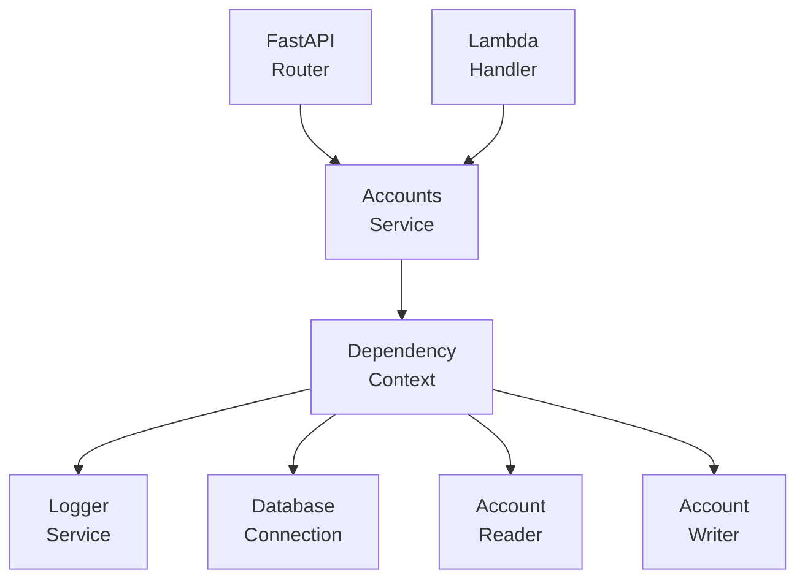
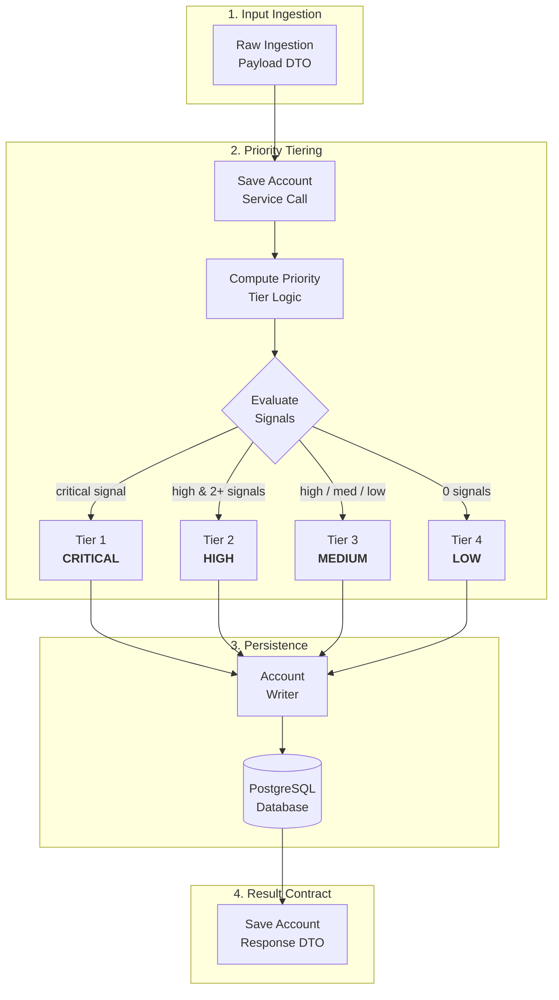
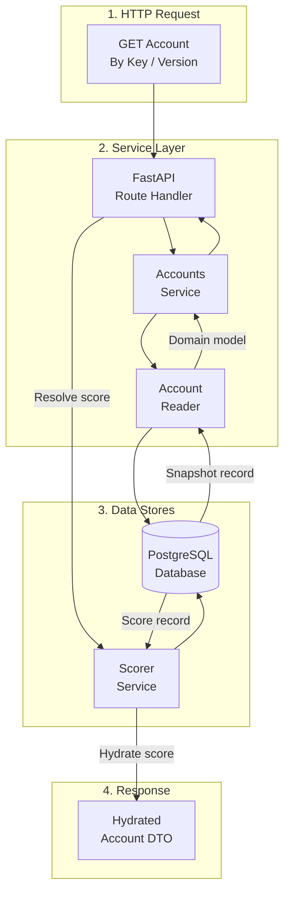
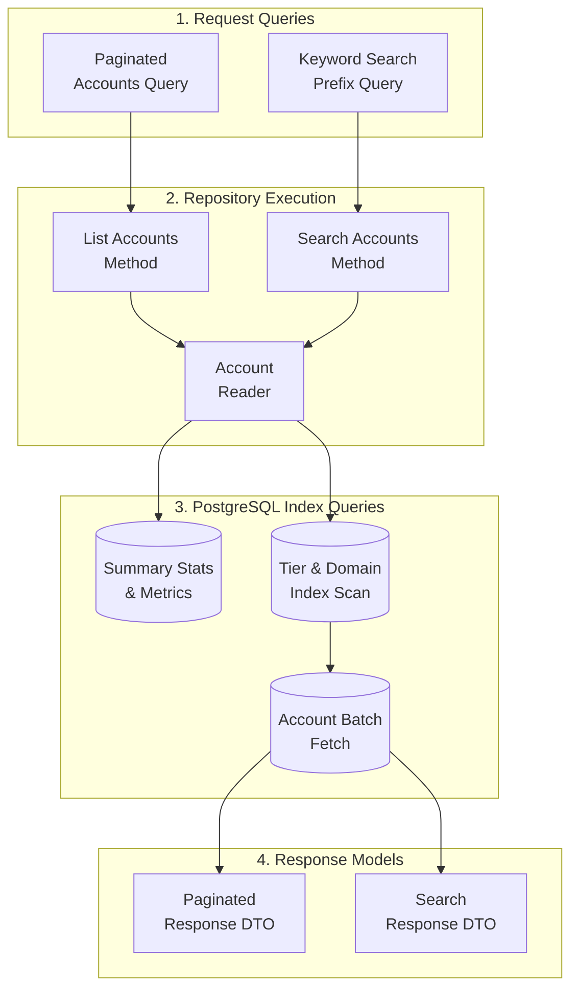

# Accounts Service

The **Accounts Service** is a core microservice in the Sales Intelligence Platform responsible for account inventory management, multi-version telemetry snapshots, attack-surface signal aggregation, automated priority tiering, and prospecting search.

---

## Architecture & Responsibilities

The service follows clean architecture and domain-driven design principles with strict dependency injection:



### Module Breakdown

```text
accounts/
├── __init__.py
├── accounts_service.py       # Main domain service orchestrator
├── api.py                    # FastAPI route handlers & canonical routes
├── dependencies.py           # Dependency injection context & factory providers
├── Dockerfile                # AWS Lambda container definition
├── lambda_handler.py         # Serverless entry point for standalone execution
├── protocols.py              # Protocol interfaces (IAccountsService, IAccountReader, etc.)
├── README.md                 # Service documentation
├── types.py                  # Domain models, enums (PriorityTier, SignalSeverity) & DTOs
├── infra/                    # Declarative Pulumi infrastructure definition
│   └── main.py
├── internals/                # Low-level repository & SQL persistence layer
│   ├── __init__.py
│   └── repositories/
│       ├── __init__.py
│       ├── reader.py         # AccountReader database repository
│       ├── writer.py         # AccountWriter database repository
│       └── models/           # Relational SQL table entities
│           ├── __init__.py
│           └── account.py
└── tests/                    # Pytest test suite for service, repositories & API
    └── test_accounts_service.py
```

---

## Domain Logic & Design Conventions

### 1. Pure Dependency Injection
The service accepts a single required context object:
```python
class AccountsService(IAccountsService):
    def __init__(self, context: AccountsServiceDependencyContext):
        self.context = context
```
All external dependencies (`logger`, `reader`, `writer`, `get_connection()`) are managed and accessed via `self.context`.

### 2. Method Ordering Standard
In every class across the service:
- **Public methods** are declared at the top of the class.
- **Private/internal helper methods** (`_` prefix) are grouped at the bottom under explicit section headers.

### 3. DTO-First Contract
- Every service method accepts **at most 2 arguments** or a typed query DTO (e.g. `ListAccountsQuery`, `AccountsBySignalQuery`).
- Every service method returns a **typed response DTO** (e.g. `AccountsPaginatedResponse`, `AccountSearchResponse`, `SaveAccountResponse`, `SummaryStats`).

### 4. Automated Priority Tiering
The service automatically evaluates account telemetry to compute a `PriorityTier`:

- **`TIER_1_CRITICAL`** (`tier_1_critical`): Account has at least one signal with `SignalSeverity.CRITICAL`.
- **`TIER_2_HIGH`** (`tier_2_high`): Account has `SignalSeverity.HIGH` and $\ge 2$ total signals.
- **`TIER_3_MEDIUM`** (`tier_3_medium`): Account has `SignalSeverity.HIGH` with 1 signal OR any medium/low signals ($>0$ signals).
- **`TIER_4_LOW`** (`tier_4_low`): Account has 0 signals.

### 5. Multi-Version Snapshot Resolution
Accounts are keyed by domain (e.g. `domain:acme.corp`) and support immutable version snapshots (`v1`, `v2`, ...). 
- Querying by domain without a version returns the **latest snapshot** with score resolution.
- Querying with a specific version (`version="v1"`) returns that exact historical snapshot.

### 6. Lazy Singleton Proxy (`_LazyAccountsServiceProxy`)
The module exposes `default_accounts_service` backed by `_LazyAccountsServiceProxy`:
- **Zero Import-Time Side Effects**: Prevents eager database connections or logger initialization during module import.
- **Prevents Circular Imports**: Eliminates import deadlocks when other services (e.g. `scorer`, `crawler`) cross-reference accounts.
- **Test Isolation & Ergonomics**: Provides clean syntax for callers while allowing test fixtures to override dependencies before runtime execution.

---

## API Reference

All endpoints are mounted under `/api/accounts`:

| Method | Route | Description |
| :--- | :--- | :--- |
| `GET` | `/api/accounts/summary` | Aggregate statistics across priority tiers and critical signals. |
| `GET` | `/api/accounts/search` | Search accounts by domain prefix or keyword. |
| `GET` | `/api/accounts/signal/{signal_name}` | List accounts affected by a specific vulnerability or signal. |
| `GET` | `/api/accounts` | Paginated account list with tier and signal filters. |
| `GET` | `/api/accounts/{account_key}` | Get detailed account record with resolved latest AI score. |
| `GET` | `/api/accounts/{account_key}/versions` | List all historical scan versions for an account. |
| `GET` | `/api/accounts/{account_key}/score-history` | Retrieve historical AI score runs for an account. |
| `GET` | `/api/accounts/health` | Health check and total account count. |
| `DELETE` | `/api/accounts/{account_key}` | Delete an account and its associated entities. |

---

## Dataflow Diagrams (DFD) & Code Entry Points

### 1. Account Ingestion & Automated Priority Tiering Dataflow



#### 🔍 Code Entry Points & Execution Trace
| Flow Step | Entry Function / Class | Source File | Description |
| :--- | :--- | :--- | :--- |
| **Service Ingestion Entry** | `AccountsService.save_account(command)` | [`accounts_service.py`](./accounts_service.py) | Ingestion entry point to save or update an account snapshot. |
| **Priority Classification** | `AccountsService.compute_priority_tier(account)` | [`accounts_service.py`](./accounts_service.py) | Evaluates security signals and computes `PriorityTier`. |
| **Database Writer Repository** | `AccountWriter.insert_account(account, ...)` | [`internals/repositories/writer.py`](./internals/repositories/writer.py) | Persists account entities, assets, and signals to PostgreSQL. |

---

### 2. Account Detail & AI Score Resolution Dataflow (`GET /api/accounts/{account_key}`)



#### 🔍 Code Entry Points & Execution Trace
| Flow Step | Entry Function / Class | Source File | Description |
| :--- | :--- | :--- | :--- |
| **API Route Handler** | `get_account_detail(account_key, version)` | [`api.py`](./api.py) | FastAPI endpoint resolving account detail and AI score. |
| **Service Detail Fetch** | `AccountsService.get_account(query)` | [`accounts_service.py`](./accounts_service.py) | Retrieves account snapshot and executes version lookup. |
| **Database Reader Repository** | `AccountReader.load_account(account_key, ...)` | [`internals/repositories/reader.py`](./internals/repositories/reader.py) | Loads domain models, assets, and security signals from SQL. |

---

### 3. Prospecting Search & Filtered Listing Dataflow (`GET /api/accounts`, `GET /api/accounts/search`)



#### 🔍 Code Entry Points & Execution Trace
| Flow Step | Entry Function / Class | Source File | Description |
| :--- | :--- | :--- | :--- |
| **API List Route** | `list_accounts_api(tier, search, page)` | [`api.py`](./api.py) | FastAPI endpoint for paginated and filtered prospecting. |
| **API Search Route** | `search_accounts_api(q, limit)` | [`api.py`](./api.py) | FastAPI endpoint for prefix-based quick search. |
| **Service List Entry** | `AccountsService.list_accounts(query)` | [`accounts_service.py`](./accounts_service.py) | Orchestrates paginated listing with total summary statistics. |
| **Service Search Entry** | `AccountsService.search_accounts(query)` | [`accounts_service.py`](./accounts_service.py) | Executes fast prefix search on account keys and domains. |
| **Database Reader Paginated** | `AccountReader.list_accounts_paginated(...)` | [`internals/repositories/reader.py`](./internals/repositories/reader.py) | Executes indexed PostgreSQL queries with limit/offset. |
| **Database Reader Search** | `AccountReader.search_accounts(query, ...)` | [`internals/repositories/reader.py`](./internals/repositories/reader.py) | Performs fast domain substring and prefix matching. |

---

## Testing & Quality Assurance

### 1. Run Unit & Integration Tests
```powershell
pytest src/services/accounts/tests -v
```

### 2. Code Coverage Report
Measure branch and line coverage across the accounts service domain:
```powershell
pytest src/services/accounts/tests -v --cov=src.services.accounts --cov-report=term-missing --cov-report=html
```

### 3. Static Type Checking (Pyright)
Ensure 100% strict type safety across protocol interfaces, models, and service classes:
```powershell
npx pyright src/services/accounts
```

### 4. Code Formatting & Linting (Ruff - PEP 8)
Check and enforce PEP 8 style guidelines with a max line length of 88 characters:

```powershell
# Check for lint issues and import sorting
ruff check src/services/accounts --line-length=88

# Check formatting without modifying files
ruff format src/services/accounts --line-length=88 --check

# Format all code to PEP 8 standard
ruff format src/services/accounts --line-length=88
```

---

## Local Development & Microservice Execution

### Run as Standalone Microservice
You can run the accounts service independently using Uvicorn and its dedicated `lambda_handler.py`:

```powershell
uvicorn src.services.accounts.lambda_handler:app --reload --port 8001
```

### Health Check
```powershell
curl http://localhost:8001/health
```

---

## Containerization & Deployment

### 1. Build & Run with Docker
The accounts service includes a standalone AWS Lambda-compatible container definition (`Dockerfile`):

```powershell
# Build container image
docker build -f src/services/accounts/Dockerfile -t accounts-microservice:latest .

# Run container locally with RIE (Runtime Interface Emulator)
docker run -p 9000:8080 --env-file backend/.env accounts-microservice:latest
```

### 2. Infrastructure as Code & Service Deployment

#### Deploy ONLY the Accounts Microservice
To build, push to ECR, and deploy only the Accounts Lambda function without touching other services:

```powershell
# Windows PowerShell
.\src\services\infra\deploy.ps1 -Service accounts -Stack dev

# macOS / Linux
./src/services/infra/deploy.sh -s accounts --stack dev
```

#### Deploy Entire Stack (All Services + Database + Frontend)
To provision or update the complete infrastructure across all microservices:

```powershell
cd src/services/infra
pulumi up --stack dev
```
