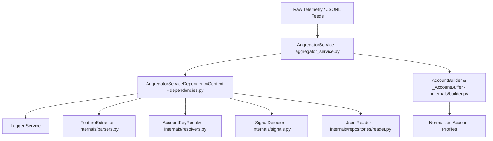
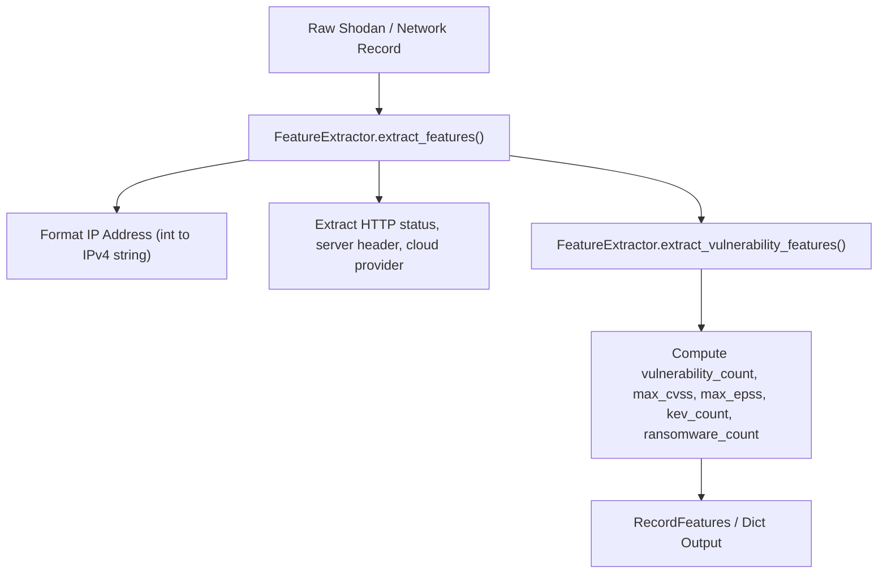
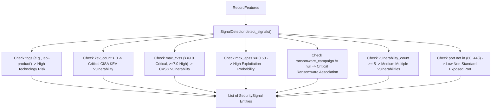
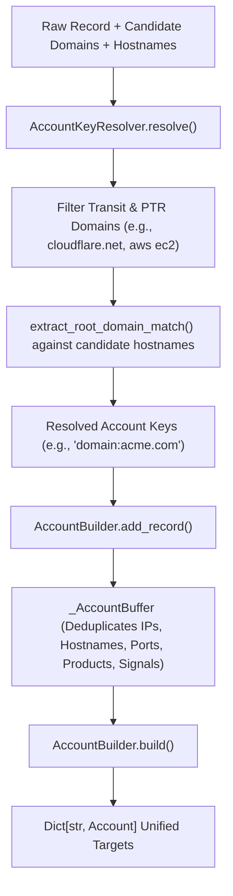

# Aggregator Service

The **Aggregator Service** is a core telemetry processing and normalization engine in the Sales Intelligence Platform. It ingests raw network observations, port scans, and vulnerability feeds, extracts standardized security features, evaluates threat heuristics to detect actionable attack surface signals, and aggregates multi-asset telemetry into unified, deduplicated target account profiles.

---

## Architecture & Responsibilities

The service follows clean architecture and domain-driven design principles with strict dependency injection:



### Module Breakdown

```text
aggregator/
├── __init__.py
├── aggregator_service.py       # Main domain service orchestrator
├── dependencies.py           # Dependency injection context & lazy singleton proxy
├── protocols.py              # Runtime checkable protocol interfaces (IAggregatorService)
├── README.md                 # Service documentation & architecture specs
├── types.py                  # Domain models, feature schemas & DTOs
├── internals/                # Specialized domain parsers, resolvers, and builders
│   ├── __init__.py
│   ├── builder.py            # Multi-record account aggregation buffer & builder
│   ├── constants.py          # Infrastructure and transit domain registries
│   ├── domain_utils.py       # Domain normalization, PTR detection, and root matching
│   ├── parsers.py            # IP formatting and vulnerability feature extraction
│   ├── resolvers.py          # Account key resolution and transit filtering
│   ├── signals.py            # Heuristic attack surface & threat signal detector
│   └── repositories/
│       ├── __init__.py
│       └── reader.py         # Streaming JSONL file reader
└── tests/                    # Pytest test suite for aggregator service
    ├── __init__.py
    └── test_aggregator_service.py
```

---

## Dataflow Diagrams (DFD)

### 1. Raw Telemetry Ingestion & Feature Extraction Flow



### 2. Security Signal Detection & Attack Surface Heuristics Flow



### 3. Account Key Resolution & Multi-Asset Aggregation Flow



---

## Signal Heuristics & Rules Matrix

| Signal Name | Category | Severity | Detection Trigger Rule |
| :--- | :--- | :--- | :--- |
| `eol_product` | `technology_risk` | `HIGH` | Tag `eol-product` present in record tags |
| `kev_vulnerability` | `vulnerability` | `CRITICAL` | `kev_count > 0` (vulnerabilities present in CISA KEV catalog) |
| `high_severity_vulnerability` | `vulnerability` | `CRITICAL` / `HIGH` | `max_cvss >= 9.0` (CRITICAL), `max_cvss >= 7.0` (HIGH) |
| `high_exploitation_probability` | `vulnerability` | `HIGH` | `max_epss >= 0.50` (Exploit Prediction Scoring System) |
| `ransomware_associated_vulnerability` | `vulnerability` | `CRITICAL` | `ransomware_count > 0` (known association with active ransomware campaigns) |
| `multiple_vulnerabilities` | `vulnerability` | `MEDIUM` | `vulnerability_count >= 5` total CVEs on the asset |
| `non_standard_exposed_port` | `attack_surface` | `LOW` | Exposed port is not standard HTTP/S (`port not in {80, 443}`) |

---

## Domain Logic & Design Conventions

### 1. Pure Dependency Injection
The aggregator service accepts its dependency context directly:
```python
class AggregatorService(IAggregatorService):
    def __init__(
        self,
        context: Optional[AggregatorServiceDependencyContext] = None,
    ) -> None:
        self.context: AggregatorServiceDependencyContext = (
            context or get_aggregator_dependency_context()
        )
```

### 2. Method Ordering Standard
In every class across the service:
- **Public methods** are declared at the top of the class.
- **Private/internal helper methods** (`_` prefix) are grouped at the bottom under explicit section headers.

### 3. Lazy Singleton Proxy
To prevent import-time side effects and circular dependency chains, `dependencies.py` provides a thread-safe lazy proxy:
```python
from src.services.aggregator.dependencies import default_aggregator_service

# Instantiation is deferred until first method invocation
accounts = default_aggregator_service.aggregate(records)
```

### 4. DTO-First Contracts
All request and response payloads use Pydantic v2 schemas (`types.py`) with `model_config = ConfigDict(extra="ignore")`.

---

## Local Verification & Testing

To run the full suite of static analysis and unit tests:

```bash
# Type check the aggregator service
npx pyright src/services/aggregator

# Lint and verify PEP 8 compliance (max line length 88)
ruff check src/services/aggregator --line-length=88
ruff format --check src/services/aggregator --line-length=88

# Run automated tests
pytest src/services/aggregator/tests -v
```
