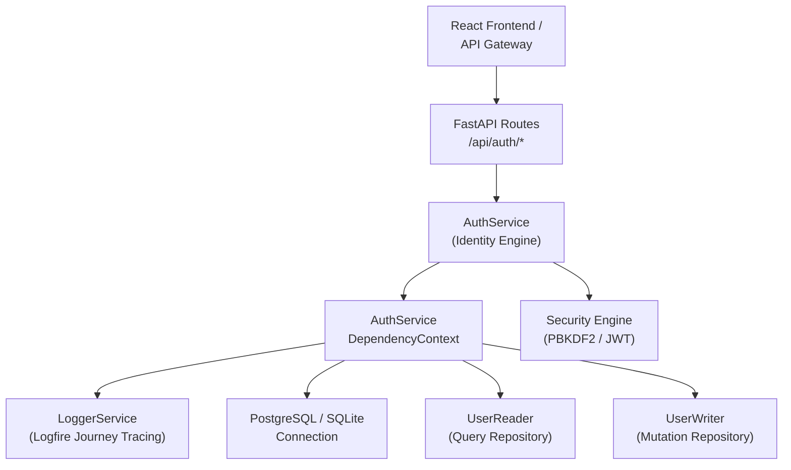
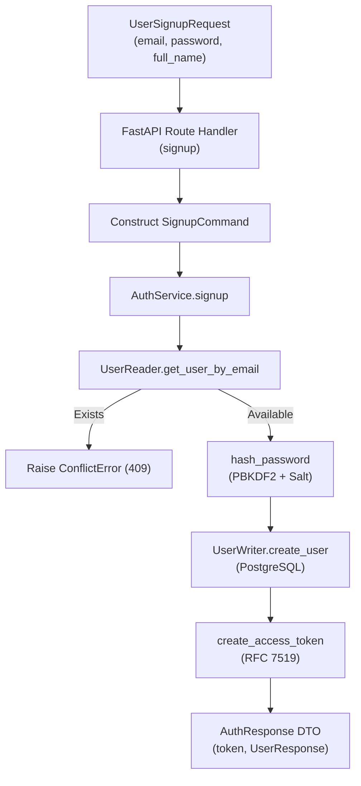
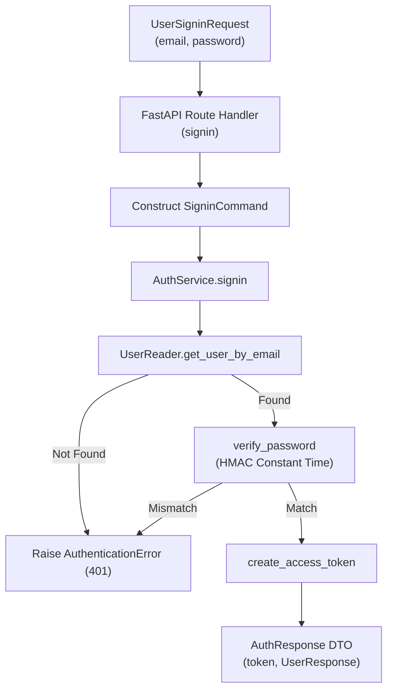

# Authentication & Identity Microservice

The **Authentication & Identity Microservice** manages user registration, credential verification, JWT token issuance, session resolution, user journey telemetry correlation, and Gemini API key configuration across the Sales Intelligence Platform.

---

## High-Level Architecture & Domain Responsibility



### Core Capabilities
1. **Cryptographic Security**: PBKDF2-HMAC-SHA256 password hashing with 100,000 iterations and cryptographically random 16-byte salts (`secrets.token_hex(16)`).
2. **Stateless JWT Sessions**: RFC 7519 compliant JSON Web Token generation with configurable expiration and claims verification.
3. **Bring-Your-Own-Key (BYOK) Management**: Per-user Gemini API key encryption, masked preview generation (`sk-...`), and runtime key retrieval for AI scoring inference.
4. **User Journey Context Tracking**: Injects active `user_id` and `user_email` into Logfire span contexts for end-to-end request tracing.

---

## Directory Structure

```
backend/src/services/auth/
├── __init__.py
├── api.py                    # FastAPI route definitions (/api/auth/*)
├── auth_service.py           # Core identity engine & IAuthService implementation
├── dependencies.py           # Dependency context, factory, and _LazyAuthServiceProxy
├── Dockerfile                # Standalone AWS Lambda container definition
├── lambda_handler.py         # AWS Lambda entry point & standalone Uvicorn router
├── protocols.py              # Strict runtime checkable protocol definitions
├── security.py               # PBKDF2 password hashing & JWT encoding utilities
├── types.py                  # Pydantic DTO contracts for requests, responses, and commands
├── infra/                    # Pulumi Infrastructure as Code
│   └── main.py
├── internals/                # Persistence repositories & SQL table entities
│   ├── __init__.py
│   └── repositories/
│       ├── __init__.py
│       ├── models.py         # Relational SQL table entities (UserTable)
│       ├── reader.py         # UserReader database repository
│       └── writer.py         # UserWriter database repository
├── tests/                    # Pytest test suite
│   ├── __init__.py
│   └── test_auth_service.py
└── README.md                 # Service documentation & architectural specs
```

---

## Domain Logic & Design Conventions

### 1. Pure Dependency Injection
The service requires a single strongly-typed context object:
```python
class AuthService(IAuthService):
    def __init__(
        self, context: Optional[AuthServiceDependencyContext] = None
    ) -> None:
        self.context: AuthServiceDependencyContext = (
            context or get_auth_dependency_context()
        )
        self._reader: IUserReader = self.context.reader
        self._writer: IUserWriter = self.context.writer
        self._logger: BaseLogger = self.context.logger
```
All external collaborators (`reader`, `writer`, `logger`, `jwt_secret`, `db_path`) are injected and accessed via `self.context`.

### 2. Method Ordering Standard
Across all service classes:
- **Public API methods** are placed at the top (`signup`, `signin`, `get_user_from_token`, `verify_token`, `get_user_by_id`, `set_user_api_key`, `create_api_key`, `list_api_keys`).
- **Private helper methods** (`_connection`) are grouped at the bottom.

### 3. DTO-First Contract
- Every registration and authentication operation consumes a validated command model (`SignupCommand`, `SigninCommand`).
- Every endpoint returns a structured, typed model (`UserResponse`, `AuthResponse`, `ApiKeyOperationResponse`, `ApiKeyListResponse`).
- Models configure `model_config = ConfigDict(extra="ignore")`.

### 4. Decoupled Protocol Interfaces
- Microservice interactions strictly implement runtime-checkable protocols (`IAuthService`, `IUserReader`, `IUserWriter`).
- Inter-service dependencies (such as [`ScorerService`](../scorer/README.md) extracting user API keys) communicate through abstract protocol contracts, allowing zero-cost mock injection during testing.

### 5. Lazy Singleton Proxy (`_LazyAuthServiceProxy`)
The module exposes `default_auth_service` backed by `_LazyAuthServiceProxy`:
- **Zero Import-Time Side Effects**: Prevents eager database connections during module import.
- **Prevents Circular Imports**: Eliminates import deadlocks when other microservices import auth dependencies.
- **Test Isolation**: Allows test suites to override dependency context before execution.

---

## API Reference

All endpoints are mounted under `/api/auth`:

| Method | Route | Description |
| :--- | :--- | :--- |
| `POST` | `/api/auth/signup` | Register a new user account and return session JWT token. |
| `POST` | `/api/auth/signin` | Authenticate user credentials and return session JWT token. |
| `GET` | `/api/auth/me` | Retrieve the authenticated user profile. |
| `POST` | `/api/auth/api-key` | Configure or generate a new Gemini API key for the current user. |
| `GET` | `/api/auth/api-key/list` | List configured API keys for the current user. |
| `POST` | `/api/auth/api-key/revoke` | Revoke an existing API key. |
| `DELETE` | `/api/auth/api-key` | Clear the configured Gemini API key from the user account. |

---

## Dataflow Diagrams (DFD) & Code Entry Points

### 1. User Registration Flow (`POST /api/auth/signup`)



### 2. User Authentication Flow (`POST /api/auth/signin`)



#### 🔍 Code Entry Points & Execution Trace
| Flow Step | Entry Function / Class | Source File | Description |
| :--- | :--- | :--- | :--- |
| **API Route Handler** | `signup(req)` | [`api.py`](./api.py) | Validates payload, converts to `SignupCommand`, returns `AuthResponse`. |
| **Signin Endpoint** | `signin(req)` | [`api.py`](./api.py) | Authenticates credentials and returns JWT token. |
| **Profile Endpoint** | `get_current_user_profile(user)` | [`api.py`](./api.py) | Returns authenticated user DTO. |
| **Auth Orchestrator** | `AuthService.signup(command)` | [`auth_service.py`](./auth_service.py) | Coordinates uniqueness check, hashing, persistence, and token issuance. |
| **Security Module** | `hash_password(pwd, salt)` | [`security.py`](./security.py) | PBKDF2-HMAC-SHA256 password hashing engine. |
| **Token Generator** | `create_access_token(user_id, email)` | [`security.py`](./security.py) | Encodes signed JWT bearer token with expiration claims. |
| **Repository Reader** | `UserReader.get_user_by_email(...)` | [`internals/repositories/reader.py`](./internals/repositories/reader.py) | Queries user record from SQL database. |
| **Repository Writer** | `UserWriter.create_user(...)` | [`internals/repositories/writer.py`](./internals/repositories/writer.py) | Inserts new user record into database. |

---

## Testing & Quality Assurance

### 1. Run Unit Tests
```powershell
pytest src/services/auth/tests -v
```

### 2. Code Coverage Report
```powershell
pytest src/services/auth/tests -v --cov=src.services.auth --cov-report=term-missing
```

### 3. Static Type Checking (Pyright)
```powershell
npx pyright src/services/auth
```

### 4. Code Formatting & Linting (Ruff - PEP 8)
```powershell
# Lint & sort imports
ruff check src/services/auth --line-length=88

# Format code
ruff format src/services/auth --line-length=88
```

---

## Local Development & Microservice Execution

### Run as Standalone Microservice
```powershell
uvicorn src.services.auth.lambda_handler:app --reload --port 8007
```

### Health Check
```powershell
curl http://localhost:8007/health
```

---

## Containerization & Deployment

### 1. Build & Run with Docker
```powershell
# Build container image
docker build -f src/services/auth/Dockerfile -t auth-microservice:latest .

# Run container locally with RIE (Runtime Interface Emulator)
docker run -p 9000:8080 --env-file backend/.env auth-microservice:latest
```

### 2. Infrastructure as Code & Service Deployment

#### Deploy ONLY the Auth Microservice
```powershell
# Windows PowerShell
.\src\services\infra\deploy.ps1 -Service auth -Stack dev

# macOS / Linux
./src/services/infra/deploy.sh -s auth --stack dev
```

#### Deploy Entire Stack (All Services + Database + Frontend)
```powershell
cd src/services/infra
pulumi up --stack dev
```
