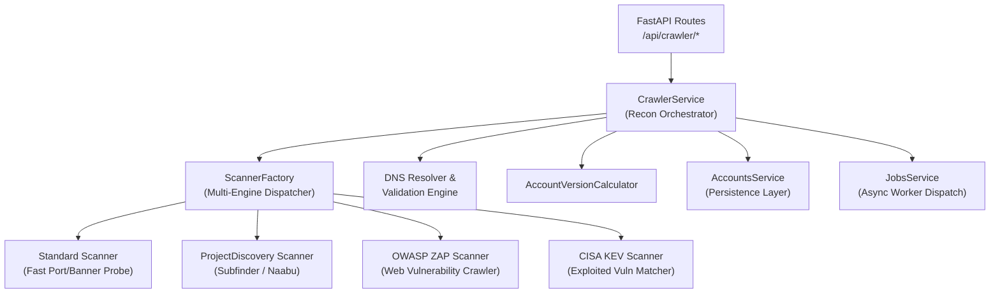
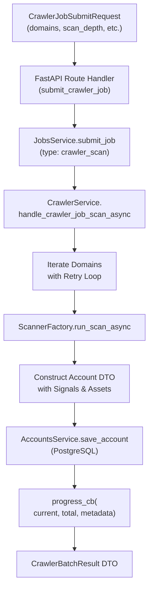
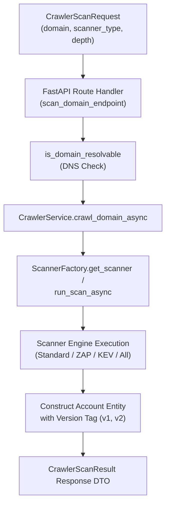

# Domain Crawler & Reconnaissance Microservice

The **Domain Crawler Microservice** orchestrates perimeter reconnaissance, active asset discovery, open-port scanning, technology stack fingerprinting, and vulnerability signal extraction across target enterprise domains.

---

## High-Level Architecture & Domain Responsibility



### Core Capabilities
1. **Multi-Engine Reconnaissance**: Pluggable scanner architecture supporting lightweight socket banners, OWASP ZAP active scanning, and CISA Known Exploited Vulnerabilities (KEV) matching.
2. **Domain Normalization & Validation**: Automatic URL stripping, syntax validation, and asynchronous DNS resolvability checks before probing.
3. **Immutable Account Perimeter Versioning**: Computes sequential account versions (`v1`, `v2`, ...) when persisting refreshed perimeter scans into the PostgreSQL database.
4. **Resilient Retry Policy**: Exponential backoff retry loop (`crawl_domain_with_retries_async`) to handle transient DNS and network timeouts.
5. **Turn-by-Turn Progress Streaming**: Emits live item-by-item progress callbacks into background jobs for real-time frontend monitoring.

---

## Scanner Engines Catalog

The crawler microservice supports four specialized pluggable scanning engines managed by [`ScannerFactory`](./internals/scanners/factory.py):

| Engine Key | Scanner Class | Category | Target Perimeter / Capabilities | Output Findings |
| :--- | :--- | :--- | :--- | :--- |
| `standard` | [`StandardScanner`](./internals/scanners/standard_scanner.py) | Active Network Probe | Fast socket probe across HTTP(80), HTTPS(443), and custom ports. Performs HTTP header banner grabbing, server technology fingerprinting, and signal extraction via `AggregatorService`. | `VulnerabilityFinding`, `SecuritySignal`, `Asset` |
| `projectdiscovery` | [`ProjectDiscoveryScanner`](./internals/scanners/projectdiscovery_scanner.py) | Subdomain & Port Recon | Active subdomain enumeration (`subfinder`) and rapid TCP port scanner (`naabu`) telemetry ingestion. Maps perimeter assets and exposed surface area. | `Asset`, Subdomain Assets, Open Ports |
| `owasp_zap` | [`OwaspZapScanner`](./internals/scanners/owasp_zap_scanner.py) | Web Application DAST | Dynamic Application Security Testing (DAST) web crawling and vulnerability detection (XSS, SQLi, CSRF, security headers misconfigurations). | `VulnerabilityFinding` (OWASP Top 10) |
| `cisa_kev` | [`CisaKevScanner`](./internals/scanners/cisa_kev_scanner.py) | Threat Intelligence | Matches discovered software versions and CPEs against the authoritative CISA Known Exploited Vulnerabilities (KEV) catalog and ransomware campaign databases. | `VulnerabilityFinding` (Exploited CVEs) |
| `all` | *Composite Aggregation* | Full Attack Surface | Concurrently executes all registered scanner engines, merging and deduplicating vulnerabilities by CVE/Finding ID. | Unified Attack Surface Profile |

---

## Directory Structure

```
backend/src/services/crawler/
├── __init__.py
├── api.py                    # FastAPI route definitions (/api/crawler/*)
├── crawler_service.py        # Core orchestration engine & ICrawlerService implementation
├── dependencies.py           # Dependency context, factory, and _LazyCrawlerServiceProxy
├── Dockerfile                # Standalone AWS Lambda container definition
├── lambda_handler.py         # AWS Lambda entry point & standalone Uvicorn router
├── protocols.py              # Strict ICrawlerService protocol definitions
├── types.py                  # Pydantic DTO contracts for requests, results, and batches
├── infra/                    # Pulumi Infrastructure as Code
│   └── main.py
├── internals/                # Private domain helpers & scanner engines
│   ├── dns.py                # DNS resolution helpers
│   ├── versioning.py         # Incremental account version calculator
│   └── scanners/             # Modular reconnaissance engines
│       ├── cisa_kev_scanner.py
│       ├── constants.py
│       ├── factory.py
│       ├── owasp_zap_scanner.py
│       ├── projectdiscovery_scanner.py
│       ├── protocols.py
│       ├── standard_scanner.py
│       └── types.py
└── tests/                    # Pytest test suite
    ├── __init__.py
    └── test_crawler_service.py
```

---

## Domain Logic & Design Conventions

### 1. Pure Dependency Injection
The service requires a single strongly-typed context object:
```python
class CrawlerService(ICrawlerService):
    def __init__(self, context: CrawlerServiceDependencyContext) -> None:
        self.context: CrawlerServiceDependencyContext = context
```
All external collaborators (`accounts_service`, `logger`, `scanner_factory`, `version_calculator`) are injected and accessed via `self.context`.

### 2. Method Ordering Standard
Across all service classes:
- **Public API methods** are placed at the top (`crawl_domain`, `scan_domain`, `handle_crawler_job_scan`).
- **Private helper methods** (`_calculate_next_account_version`, `_is_domain_resolvable`) are placed at the bottom.

### 3. DTO-First Contract
- Every scanning operation consumes a validated Pydantic model (`CrawlerScanRequest`, `CrawlerRunRequest`, `CrawlerJobSubmitRequest`).
- Every scan returns a structured, typed model (`CrawlerScanResult`, `CrawlerBatchResult`, `CrawlerRunResponse`).

### 4. Decoupled Protocol Interfaces
- Microservice boundary interactions strictly implement runtime-checkable protocols (`ICrawlerService`, `IScanner`).
- Inter-service dependencies (e.g. `IAccountsService`, `IAggregatorService`, `IJobsService`) communicate through abstract protocol contracts, allowing zero-cost mock injection during testing.

### 5. Lazy Singleton Proxy (`_LazyCrawlerServiceProxy`)
The module exposes `default_crawler_service` backed by `_LazyCrawlerServiceProxy`:
- **Zero Import-Time Side Effects**: Prevents eager sub-dependency initialization or scanner registrations during module import.
- **Prevents Circular Imports**: Eliminates import deadlocks when other microservices (such as `accounts` or `jobs`) wire up crawler background handlers.
- **Test Isolation & Ergonomics**: Allows test suites to override dependency context before runtime execution.

---

## API Reference

All endpoints are mounted under `/api/crawler`:

| Method | Route | Description |
| :--- | :--- | :--- |
| `POST` | `/api/crawler/jobs` | Submit an asynchronous multi-domain crawler background job. |
| `GET` | `/api/crawler/jobs` | List all historical crawler background scan jobs. |
| `GET` | `/api/crawler/jobs/{job_id}` | Retrieve real-time progress and details for a specific crawler job. |
| `POST` | `/api/crawler/jobs/{job_id}/retry` | Re-queue a failed crawler job for execution. |
| `POST` | `/api/crawler/run` | Execute a synchronous multi-domain batch crawl. |
| `POST` | `/api/crawler/scan` | Perform a single-domain reconnaissance scan. |
| `GET` | `/api/crawler/scanners` | List available scanner engines and catalog metadata. |

---

## Dataflow Diagrams (DFD) & Code Entry Points

### 1. Asynchronous Crawler Background Job Flow (`POST /api/crawler/jobs`)



### 2. Synchronous Direct Reconnaissance Flow (`POST /api/crawler/scan`)



#### 🔍 Code Entry Points & Execution Trace
| Flow Step | Entry Function / Class | Source File | Description |
| :--- | :--- | :--- | :--- |
| **API Route Handler** | `submit_crawler_job(req)` | [`api.py`](./api.py) | Validates domain inputs and queues background job. |
| **Direct Scan Endpoint** | `scan_domain_endpoint(req)` | [`api.py`](./api.py) | Executes single-domain reconnaissance on demand. |
| **Job Handler Entry** | `CrawlerService.handle_crawler_job_scan(...)` | [`crawler_service.py`](./crawler_service.py) | Background job worker executing multi-domain scans. |
| **Recon Orchestrator** | `CrawlerService.crawl_domain_async(req)` | [`crawler_service.py`](./crawler_service.py) | Coordinates DNS check, scanner dispatch, and account persistence. |
| **Scanner Dispatcher** | `ScannerFactory.run_scan_async(...)` | [`internals/scanners/factory.py`](./internals/scanners/factory.py) | Routes domain request to the appropriate scanner engine. |
| **Version Calculator** | `AccountVersionCalculator.calculate_next_version(...)` | [`internals/versioning.py`](./internals/versioning.py) | Computes next incremental version tag (`v1`, `v2`). |

---

## Testing & Quality Assurance

### 1. Run Unit & Integration Tests
```powershell
pytest src/services/crawler/tests -v
```

### 2. Code Coverage Report
```powershell
pytest src/services/crawler/tests -v --cov=src.services.crawler --cov-report=term-missing --cov-report=html
```

### 3. Static Type Checking (Pyright)
```powershell
npx pyright src/services/crawler
```

### 4. Code Formatting & Linting (Ruff - PEP 8)
```powershell
# Lint & sort imports
ruff check src/services/crawler --line-length=88

# Format code
ruff format src/services/crawler --line-length=88
```

---

## Local Development & Microservice Execution

### Run as Standalone Microservice
```powershell
uvicorn src.services.crawler.lambda_handler:app --reload --port 8004
```

### Health Check
```powershell
curl http://localhost:8004/health
```

---

## Containerization & Deployment

### 1. Build & Run with Docker
```powershell
# Build container image
docker build -f src/services/crawler/Dockerfile -t crawler-microservice:latest .

# Run container locally with RIE (Runtime Interface Emulator)
docker run -p 9000:8080 --env-file backend/.env crawler-microservice:latest
```

### 2. Infrastructure as Code & Service Deployment

#### Deploy ONLY the Crawler Microservice
```powershell
# Windows PowerShell
.\src\services\infra\deploy.ps1 -Service crawler -Stack dev

# macOS / Linux
./src/services/infra/deploy.sh -s crawler --stack dev
```

#### Deploy Entire Stack (All Services + Database + Frontend)
```powershell
cd src/services/infra
pulumi up --stack dev
```

---

## Future Roadmap & Scopes of Improvement (TODO)

The following architectural, analytical, and operational enhancements are planned for future iterations of the crawler microservice:

### 1. Performance & Concurrency (High Priority)
* **Bounded Asynchronous Batch Scanning (`asyncio.Semaphore`)**:
  - *Current state*: [`handle_crawler_job_scan_async`](./crawler_service.py) processes domains sequentially in a `for` loop.
  - *Improvement*: Add an `asyncio.Semaphore(concurrency=5)` pool so multi-domain jobs (e.g., 50 target enterprise domains) scan concurrently while avoiding DNS socket exhaustion or thread starvation.

### 2. Attack Surface Intelligence & Passive Recon (Medium Priority)
* **Passive Certificate Transparency Log Querying (`crt.sh`)**:
  - *Current state*: Subdomain discovery probes a static list of common subdomains (`api`, `vpn`, `admin`, `portal`, `dev`, `stage`).
  - *Improvement*: Integrate a passive lookup against public Certificate Transparency logs (e.g., `crt.sh` JSON API) to discover real subdomains with zero active probing or network noise.
* **Passive Telemetry Integrations (Shodan / Censys / Whois / RDAP)**:
  - *Current state*: The scanner relies on direct socket connections and HTTP banner headers.
  - *Improvement*: Add optional API connectors for Shodan/Censys to enrich enterprise accounts with passive historical port maps, ASN owner metadata, and SSL certificate expiration dates.

### 3. Perimeter Drift & Sales Trigger Deltas (High Business Value)
* **Perimeter Attack Surface Drift Analysis ($v1 \rightarrow v2$ Delta)**:
  - *Current state*: When an account is re-crawled, a new version tag (`v2`) is saved to the database.
  - *Improvement*: Compute an automated perimeter delta comparing previous vs. new assets:
    - *Newly opened / non-standard ports (e.g. port 8080, 22, 3389).*
    - *New subdomains exposed since last scan.*
    - *Newly introduced CISA KEV vulnerabilities.*

### 4. Safety, WAF Evasion & Compliance (Medium Priority)
* **Scan Politeness, Jitter & Proxy Support**:
  - *Current state*: Scans fire rapid socket probes with a static timeout.
  - *Improvement*: Add `request_delay_ms` jitter and optional forward proxy support to `ScannerEngineOptions` to prevent triggering Cloudflare/Akamai anti-bot bans during legitimate prospecting.

### Summary Table

| Scope of Improvement | Area | Impact | Complexity |
| :--- | :--- | :--- | :--- |
| **`asyncio.Semaphore` Bounded Concurrency** | Performance | High (5x-10x faster batch crawl jobs) | Low |
| **Perimeter Drift Delta ($v1 \rightarrow v2$)** | Sales Intel | High (Generates instant trigger events for reps) | Medium |
| **Passive Certificate Transparency (`crt.sh`)** | Recon Depth | High (Discovers real hidden subdomains without active noise) | Low |
| **Passive Shodan / Censys Connectors** | Data Enrichment | Medium (Enriches ASN, SSL expiry, and cloud provider tags) | Medium |
| **Request Jitter & Proxy Support** | Resilience | Medium (Prevents IP rate-limiting & WAF blocking) | Low |
