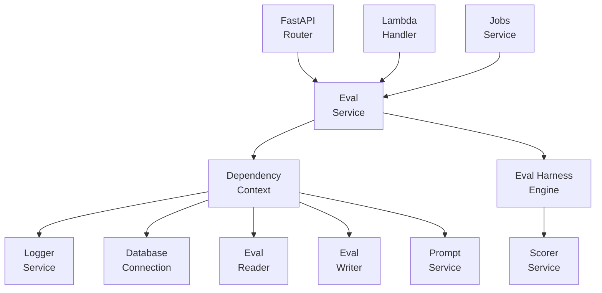
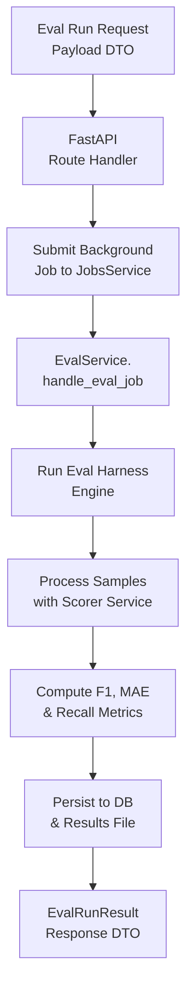
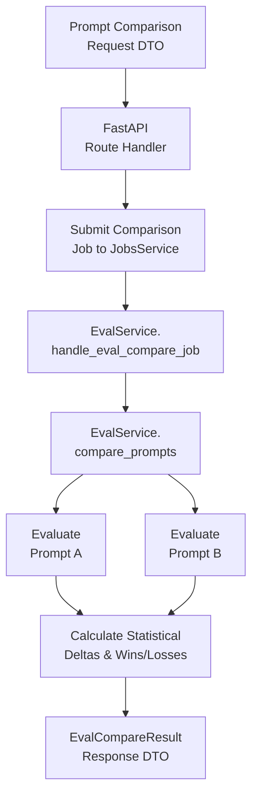

# Evaluation Service

The **Evaluation Service** is the AI benchmarking, validation, and comparative assessment engine in the Sales Intelligence Platform. It runs batch evaluations of prompt templates across hand-labeled cybersecurity telemetry datasets, calculates statistical classification and regression metrics (Macro/Weighted F1, critical threat recall, MAE, score-to-tier consistency), and generates comparative delta analytics between prompt revisions.

---

## Architecture & Responsibilities

The service follows clean architecture and domain-driven design principles with strict dependency injection:



### Module Breakdown

```text
eval/
├── __init__.py
├── api.py                    # FastAPI route handlers & canonical endpoints
├── dependencies.py           # Dependency injection context & lazy proxy
├── Dockerfile                # AWS Lambda container definition
├── eval_harness.py           # Core evaluation metrics calculation & benchmark runner
├── eval_service.py           # Domain service orchestrator & background job handlers
├── lambda_handler.py         # Serverless entry point for standalone execution
├── protocols.py              # Protocol interfaces (IEvalService, IEvalReader, IEvalWriter)
├── README.md                 # Service documentation & architecture specs
├── types.py                  # Domain models, commands, and metric response DTOs
├── infra/                    # Declarative Pulumi infrastructure definition
│   └── main.py
├── internals/                # Persistence repositories & internal utilities
│   ├── __init__.py
│   └── repositories/
│       ├── __init__.py
│       ├── models.py         # Relational SQL table entities (EvalRunTable)
│       ├── reader.py         # EvalReader database repository
│       └── writer.py         # EvalWriter database repository
├── labeled_sets/             # Ground-truth labeled benchmark datasets
│   └── eval_v1.json
└── tests/                    # Pytest test suite for eval service
    ├── __init__.py
    └── test_eval_service.py
```

---

## Domain Logic & Design Conventions

### 1. Pure Dependency Injection
The service accepts a single required context object:
```python
class EvalService(IEvalService):
    def __init__(self, context: EvalServiceDependencyContext) -> None:
        self.context: EvalServiceDependencyContext = context
```
All external dependencies (`logger`, `reader`, `writer`, `db_service`, `prompt_service`) are managed and accessed via `self.context`.

### 2. Method Ordering Standard
In every class across the service:
- **Public methods** are declared at the top of the class.
- **Private/internal helper methods** (`_` prefix) are grouped at the bottom under explicit section headers.

### 3. DTO-First Contract
- Every evaluation execution accepts a strongly-typed Pydantic command (`RunEvalCommand`, `ComparePromptsCommand`).
- Every service method returns a typed response DTO (`EvalRunResult`, `EvalCompareResult`, `EvalHistoryItem`, `EvalMetricDetails`).

### 4. Comprehensive Evaluation Metrics

The evaluation harness evaluates LLM scoring and reasoning quality using the following standardized metrics:

| Evaluation Metric | Description & Evaluation Objective |
| :--- | :--- |
| **Tier Allocation Accuracy** | Measures the percentage of evaluation accounts whose predicted risk tier exactly matches the human-verified ground-truth tier (`tier_1_critical`, `tier_2_high`, `tier_3_medium`, `tier_4_low`). Evaluates the model's overall discrete risk categorization accuracy. |
| **Macro F1-Score** | Computes the unweighted arithmetic mean of F1-scores across all four priority tiers. Evaluates balanced performance across all tiers, ensuring rare or specialized risk categories are treated with equal weight. |
| **Weighted F1-Score** | Calculates the aggregate F1-score across all tiers weighted by the number of true instances (class support). Evaluates real-world classification effectiveness against the benchmark dataset distribution. |
| **Critical Threat Recall** | Measures the true-positive detection rate specifically for `tier_1_critical` accounts ($\frac{\text{TP}}{\text{TP} + \text{FN}}$). Enforces the platform's **"Zero Missed Threats"** standard, ensuring active CISA KEV exploits, ransomware perimeters, and exposed admin interfaces are never overlooked. |
| **Score-to-Tier Consistency** | Evaluates whether the generated continuous risk score ($0–100$) mathematically aligns with the discrete tier assigned (e.g., Score $85–100 \rightarrow \text{Tier 1}$, $70–84 \rightarrow \text{Tier 2}$, $40–69 \rightarrow \text{Tier 3}$, $0–39 \rightarrow \text{Tier 4}$). Detects internal reasoning discrepancies where the LLM assigns a high score but tags a lower priority tier. |
| **Score MAE (Mean Absolute Error)** | Measures the average absolute point difference between the model's numeric score and the ground-truth benchmark score ($\frac{1}{N} \sum \|\text{Score}_{\text{pred}} - \text{Score}_{\text{true}}\|$). Lower values indicate tighter continuous score calibration. |
| **Score RMSE (Root Mean Squared Error)** | Computes the root mean squared error ($\sqrt{\frac{1}{N} \sum (\text{Score}_{\text{pred}} - \text{Score}_{\text{true}})^2}$). Heavily penalizes catastrophic scoring outliers and severe hallucinations; lower is better. |
| **Accuracy within $\pm 5$ Points** | Calculates the percentage of evaluation examples where the predicted numerical score falls within a $\pm 5$-point tolerance band of the ground-truth score. Evaluates practical scoring stability for sales lead routing. |
| **Per-Tier Precision, Recall & F1** | Breaks down precision, recall, and harmonic F1-score for each discrete tier to identify exact tier boundary confusions (e.g., distinguishing Tier 2 high-risk from Tier 3 medium-risk accounts). |

### 5. Asynchronous Background Execution
Live AI evaluations and prompt comparisons are dispatched as asynchronous background jobs via the `JobsService`, providing turn-by-turn progress streaming callbacks and execution checkpoints.

### 6. Lazy Singleton Proxy (`_LazyEvalServiceProxy`)
The module exposes `default_eval_service` backed by `_LazyEvalServiceProxy`:
- **Zero Import-Time Side Effects**: Prevents eager database connections or logger initialization during module import.
- **Prevents Circular Imports**: Eliminates import deadlocks when other services reference evaluation utilities.
- **Test Isolation & Ergonomics**: Provides clean syntax for callers while allowing test fixtures to override dependencies before runtime execution.

---

## API Reference

All endpoints are mounted under `/api/eval`:

| Method | Route | Description |
| :--- | :--- | :--- |
| `GET` | `/api/eval/prompts` | List all available registered prompt templates for evaluation. |
| `GET` | `/api/eval/dataset` | Retrieve the default ground-truth labeled evaluation dataset. |
| `POST` | `/api/eval/run` | Submit an asynchronous single prompt evaluation job. |
| `POST` | `/api/eval/compare` | Submit an asynchronous A/B prompt comparison benchmark job. |
| `GET` | `/api/eval/history` | List all historical evaluation runs and benchmark summaries. |
| `GET` | `/api/eval/results/{filename}` | Retrieve full detailed predictions and metrics for a specific run. |

---

## Dataflow Diagrams (DFD) & Code Entry Points

### 1. Single Prompt Evaluation Flow (`POST /api/eval/run`)



#### 🔍 Code Entry Points & Execution Trace
| Flow Step | Entry Function / Class | Source File | Description |
| :--- | :--- | :--- | :--- |
| **API Route Handler** | `execute_eval_run(req)` | [`api.py`](./api.py) | FastAPI endpoint submitting evaluation job. |
| **Job Handler Entry** | `EvalService.handle_eval_job(job_id, payload)` | [`eval_service.py`](./eval_service.py) | Worker entry point unpacking job payloads. |
| **Domain Execution** | `EvalService.run_eval(command)` | [`eval_service.py`](./eval_service.py) | Orchestrates dataset loading, inference passes, and persistence. |
| **Harness Engine** | `run_eval(...)` | [`eval_harness.py`](./eval_harness.py) | Parallel execution engine and metric aggregation. |
| **Database Writer** | `EvalWriter.save_results(...)` | [`internals/repositories/writer.py`](./internals/repositories/writer.py) | Persists summary metrics to `EvalRunTable` in PostgreSQL. |

---

### 2. Side-by-Side Prompt Comparison Flow (`POST /api/eval/compare`)



#### 🔍 Code Entry Points & Execution Trace
| Flow Step | Entry Function / Class | Source File | Description |
| :--- | :--- | :--- | :--- |
| **API Route Handler** | `execute_eval_compare(req)` | [`api.py`](./api.py) | FastAPI endpoint submitting comparison job. |
| **Job Handler Entry** | `EvalService.handle_eval_compare_job(...)` | [`eval_service.py`](./eval_service.py) | Worker entry point for prompt comparison jobs. |
| **Comparison Entry** | `EvalService.compare_prompts(command)` | [`eval_service.py`](./eval_service.py) | Concurrently runs prompt benchmarks and computes delta analytics. |
| **Delta Generator** | `generate_comparison_dict(res_a, res_b)` | [`eval_harness.py`](./eval_harness.py) | Computes accuracy, F1, MAE, and distribution deltas. |

---

## Testing & Quality Assurance

### 1. Run Unit & Integration Tests
```powershell
pytest src/services/eval/tests -v
```

### 2. Code Coverage Report
Measure branch and line coverage across the evaluation service domain:
```powershell
pytest src/services/eval/tests -v --cov=src.services.eval --cov-report=term-missing --cov-report=html
```

### 3. Static Type Checking (Pyright)
Ensure 100% strict type safety across protocol interfaces, models, and service classes:
```powershell
npx pyright src/services/eval
```

### 4. Code Formatting & Linting (Ruff - PEP 8)
Check and enforce PEP 8 style guidelines with a max line length of 88 characters:

```powershell
# Check for lint issues and import sorting
ruff check src/services/eval --line-length=88

# Check formatting without modifying files
ruff format src/services/eval --line-length=88 --check

# Format all code to PEP 8 standard
ruff format src/services/eval --line-length=88
```

---

## Local Development & Microservice Execution

### Run as Standalone Microservice
You can run the evaluation service independently using Uvicorn and its dedicated `lambda_handler.py`:

```powershell
uvicorn src.services.eval.lambda_handler:app --reload --port 8003
```

### Health Check
```powershell
curl http://localhost:8003/health
```

---

## Containerization & Deployment

### 1. Build & Run with Docker
The eval service includes a standalone AWS Lambda-compatible container definition (`Dockerfile`):

```powershell
# Build container image
docker build -f src/services/eval/Dockerfile -t eval-microservice:latest .

# Run container locally with RIE (Runtime Interface Emulator)
docker run -p 9000:8080 --env-file backend/.env eval-microservice:latest
```

### 2. Infrastructure as Code & Service Deployment

#### Deploy ONLY the Eval Microservice
To build, push to ECR, and deploy only the Eval Lambda function without touching other services:

```powershell
# Windows PowerShell
.\src\services\infra\deploy.ps1 -Service eval -Stack dev

# macOS / Linux
./src/services/infra/deploy.sh -s eval --stack dev
```

#### Deploy Entire Stack (All Services + Database + Frontend)
To provision or update the complete infrastructure across all microservices:

```powershell
cd src/services/infra
pulumi up --stack dev
```

---

## Future Roadmap & Scopes of Improvement (TODO)

The following architectural, analytical, and operational enhancements are planned for future iterations of the evaluation microservice:

### 1. Architectural & Dependency Injection Cleanliness (High Priority)
* **Inject `IScorerService` into `eval_harness.py`**:
  - *Current state*: [`eval_harness.py`](./eval_harness.py) calls `create_scorer_service(...)` directly inside its scoring loop and inspects `os.getenv("GEMINI_API_KEY")`.
  - *Improvement*: Pass `scorer_service: Optional[IScorerService]` directly through the command context from [`eval_service.py`](./eval_service.py). This prevents the harness from managing its own API keys or instantiating redundant client connections.

### 2. Evaluator Depth & New Metrics (Medium Priority)
* **$4 \times 4$ Confusion Matrix Generation**:
  - *Current state*: The harness calculates individual precision and recall per tier, but does not construct the full $4 \times 4$ confusion matrix (`expected_tier` vs `predicted_tier`).
  - *Improvement*: Add a `confusion_matrix: Dict[str, Dict[str, int]]` field to [`EvalMetricDetails`](./types.py) so the frontend UI can render a heatmap showing exact tier transition drift (e.g., *how many Tier 1 Criticals were misclassified as Tier 2 High*).
* **LLM-as-a-Judge / Semantic Outreach Quality**:
  - *Current state*: Evaluation focuses purely on numeric score MAE/RMSE and tier classification accuracy.
  - *Improvement*: The scorer also generates `suggested_outreach` and `score_rationale`. Adding semantic evaluation (e.g., checking if specific CISA CVEs or ransomware signals are properly referenced in the outreach message) would assess the sales enablement quality of the prompts.

### 3. Data Persistence & Serverless Resilience (Medium Priority)
* **Database-First Result Persistence for Lambda**:
  - *Current state*: [`eval_service.py`](./eval_service.py) defaults to saving `.json` files in `/tmp/evals/results` when running in AWS Lambda.
  - *Improvement*: Ensure the full prediction payload is persisted directly in PostgreSQL (`eval_runs` table) or S3, so historical eval results aren't lost across Lambda container recycling.

### 4. Evaluation Benchmark Dataset Expansion (Low Priority)
* **Hard Negative & Boundary Edge Cases in `eval_v1.json`**:
  - Expand the labeled dataset with edge cases:
    - Accounts with many low-severity informational ports vs. accounts with a single unpatched zero-day CISA KEV exploit.
    - Cloud misconfiguration vs. on-prem legacy web servers.

### Summary Table

| Scope of Improvement | Area | Impact | Complexity |
| :--- | :--- | :--- | :--- |
| **Pass `IScorerService` via DI to Harness** | Architecture | High (Clean DI & zero redundant client instantiations) | Low |
| **Full $4 \times 4$ Confusion Matrix DTO** | Telemetry | High (Enables UI heatmap & drift analysis) | Low |
| **DB / S3 JSON Result Storage** | Serverless / Infra | Medium (Prevents losing historical runs on Lambda) | Medium |
| **Semantic Outreach / Rationale Eval** | GenAI Quality | Medium (Evaluates sales email personalization quality) | Medium |
| **Benchmark Dataset Expansion** | ML / Data | Medium (Tests prompt robustness against edge cases) | Low |
