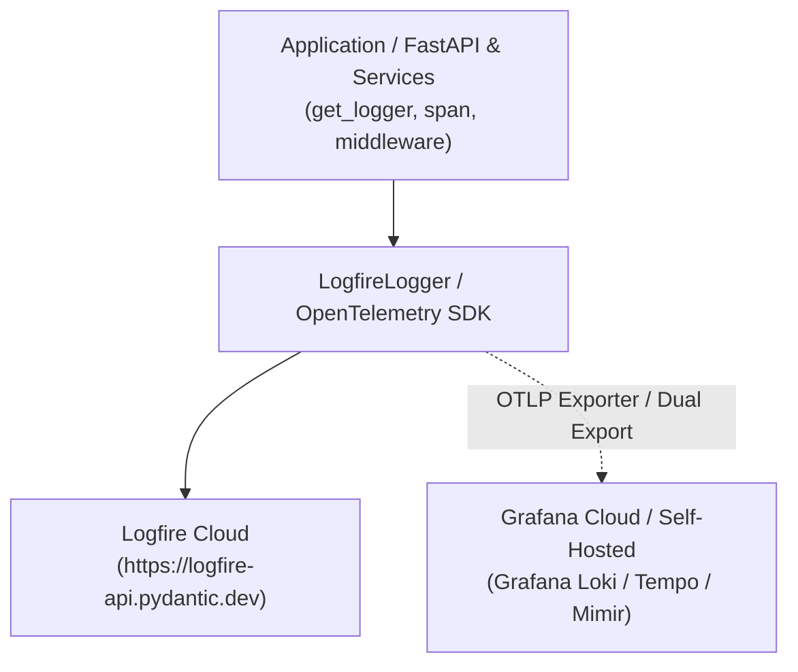

# TODO: Telemetry Export to Grafana via Logfire / OpenTelemetry

## Objective
Explore and implement dual telemetry streaming so that logs, traces, and metrics are sent to **Grafana** (Grafana Loki for logs, Grafana Tempo for distributed traces, and Grafana Mimir/Prometheus for metrics) alongside **Logfire**.

---

## Background & Architecture Overview
Because `Logfire` is built on top of standard `opentelemetry-sdk`, it uses standard OpenTelemetry `TracerProvider` and `LoggerProvider`. This allows forwarding or dual-exporting OTLP telemetry to Grafana without rewriting application-level logging code.



---

## Potential Implementation Approaches

### Approach 1: Logfire `additional_span_processors` & Custom OTLP Exporter
Pass standard OpenTelemetry OTLP exporters into `logfire.configure(...)` using `additional_span_processors` or `log_record_processors`:

```python
from opentelemetry.exporter.otlp.proto.http.trace_exporter import OTLPSpanExporter
from opentelemetry.sdk.trace.export import BatchSpanProcessor
import logfire

grafana_otlp_exporter = OTLPSpanExporter(
    endpoint="https://otlp-gateway-prod-us-east-0.grafana.net/otlp/v1/traces",
    headers={"Authorization": f"Basic {GRAFANA_OTLP_AUTH_TOKEN}"},
)

logfire.configure(
    token=LOGFIRE_TOKEN,
    service_name="sales-intel-api",
    send_to_logfire=True,
    additional_span_processors=[BatchSpanProcessor(grafana_otlp_exporter)],
)
```

### Approach 2: OpenTelemetry Collector Sidecar / Gateway
1. Configure `logfire` or standard OpenTelemetry to send OTLP to a local OpenTelemetry Collector sidecar (`http://localhost:4317` or `http://localhost:4318`).
2. The OTel Collector pipeline fans out and routes telemetry to:
   - Target A: Logfire Cloud (`https://logfire-api.pydantic.dev`)
   - Target B: Grafana Cloud / Loki / Tempo (`https://otlp-gateway-...grafana.net/otlp`)

---

## Action Items & Next Steps

1. [ ] **Evaluate Grafana Setup**:
   - Determine if using **Grafana Cloud** (OTLP Gateway endpoint) or **Self-hosted Grafana** (Loki + Tempo + Prometheus/Mimir stack).
2. [ ] **Define Required Environment Variables**:
   - `GRAFANA_OTLP_ENDPOINT`: e.g. `https://otlp-gateway-prod-us-east-0.grafana.net/otlp`
   - `GRAFANA_INSTANCE_ID`: Grafana Cloud instance / user ID
   - `GRAFANA_API_KEY` or `GRAFANA_OTLP_TOKEN`: Authentication token
   - `ENABLE_GRAFANA_EXPORT`: Boolean toggle (`true` / `false`)
3. [ ] **Test OTLP Exporter Package**:
   - Add `opentelemetry-exporter-otlp` to `requirements.txt` if not already satisfied.
   - Verify HTTP vs gRPC transport performance.
4. [ ] **Prototype Dual Exporter in `internal/logfire_logger.py`**:
   - Update `init_logfire_client` to check for Grafana configuration and append `BatchSpanProcessor(OTLPSpanExporter(...))` and `BatchLogRecordProcessor(OTLPLogExporter(...))` when enabled.
5. [ ] **Verify End-to-End Traces in Grafana**:
   - Verify `X-Trace-Id` correlation in Grafana Tempo trace explorer.
   - Verify log attributes (`user_id`, `client_ip`, latency) index correctly in Grafana Loki.
