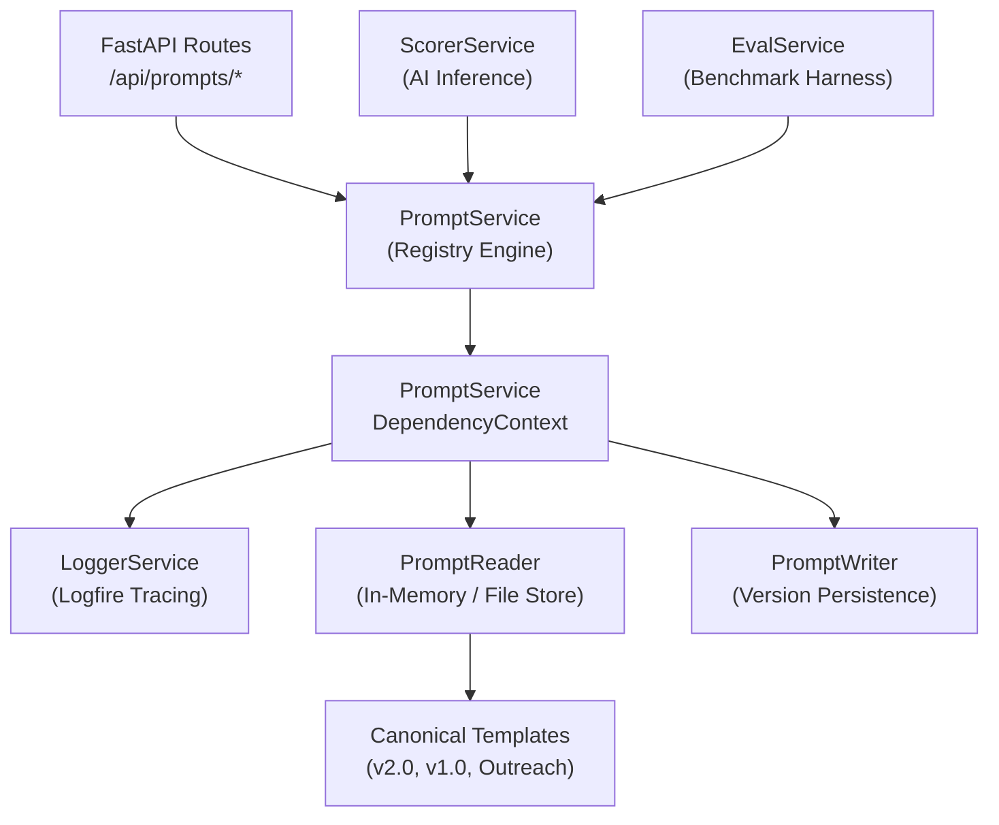
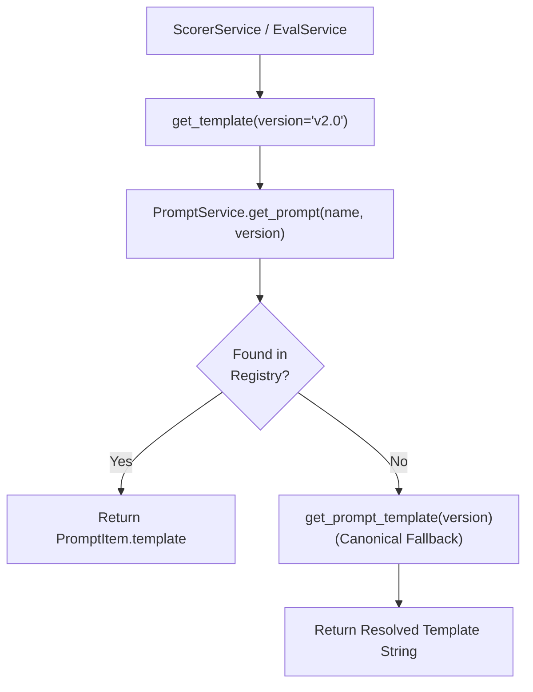
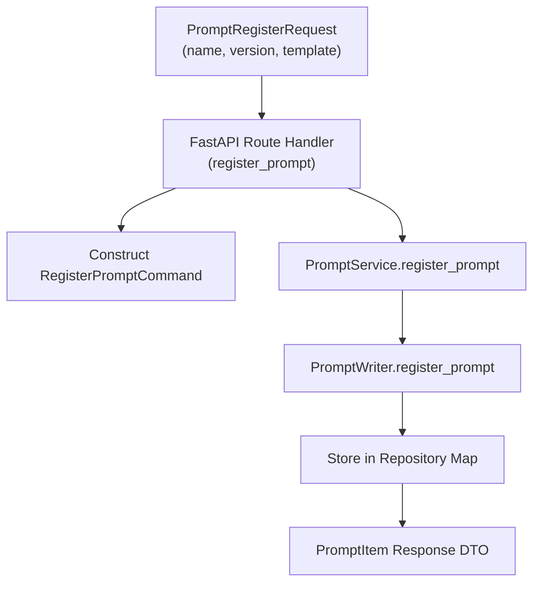

# Prompt Registry & Template Management Microservice

The **Prompt Registry Microservice** is a centralized domain service in the Sales Intelligence Platform responsible for cataloging, versioning, dynamically resolving, and persisting calibrated LLM prompt templates used for risk scoring, threat intelligence synthesis, and executive sales outreach generation.

---

## High-Level Architecture & Domain Responsibility



### Core Capabilities
1. **Canonical Template Catalog**: Maintains calibrated prompt definitions with strict anti-hallucination guardrails and ground-truth telemetry formatting rules.
2. **Dynamic Version Resolution**: Resolves semantic versions (`v2.0`, `v1.0`, custom versions) with graceful fallbacks.
3. **Runtime Prompt Registration**: Allows sales and security engineers to register custom prompt variations for A/B testing and evaluation benchmarks.
4. **Canonical Protection**: Prevents accidental mutation or deletion of production-critical baseline prompt templates (`v1.0`, `v2.0`).

---

## Directory Structure

```
backend/src/services/prompts/
├── __init__.py
├── api.py                    # FastAPI route definitions (/api/prompts/*)
├── dependencies.py           # Dependency context, factory, and _LazyPromptServiceProxy
├── Dockerfile                # Standalone AWS Lambda container definition
├── lambda_handler.py         # AWS Lambda entry point & standalone Uvicorn router
├── prompt_service.py         # Core prompt registry engine & IPromptService implementation
├── protocols.py              # Strict runtime checkable protocol definitions
├── templates.py              # Canonical prompt strings & default catalog
├── types.py                  # Pydantic DTO contracts for requests, responses, and items
├── infra/                    # Pulumi Infrastructure as Code
│   └── main.py
├── internals/                # Persistence repositories & internal utilities
│   ├── __init__.py
│   └── repositories/
│       ├── __init__.py
│       ├── reader.py         # PromptReader repository
│       └── writer.py         # PromptWriter repository
├── tests/                    # Pytest test suite
│   ├── __init__.py
│   └── test_prompt_service.py
└── README.md                 # Service documentation & architectural specs
```

---

## Canonical Prompt Catalog

| Prompt Name | Version | Type | Primary Use Case | Key Guardrails & Features |
| :--- | :--- | :--- | :--- | :--- |
| `account_scoring` | `v2.0` | `scoring` | Production AI Risk Posture Scoring | Strict 4-tier calibration (`tier_1_critical` to `tier_4_low`), score-to-tier binding, strict evidence grounding, zero hallucinated CVEs. |
| `account_scoring` | `v1.0` | `scoring` | Legacy Baseline Benchmark | Initial unconstrained risk scoring prompt for historical evaluation and metric drift comparison. |
| `outreach_draft` | `v1.0` | `outreach` | Executive SDR Cold Emailing | Generates hyper-personalized C-level sales emails grounded in detected perimeter vulnerabilities. |

---

## Domain Logic & Design Conventions

### 1. Pure Dependency Injection
The service requires a single strongly-typed context object:
```python
class PromptService(IPromptService):
    def __init__(
        self, context: Optional[PromptServiceDependencyContext] = None
    ) -> None:
        self.context: PromptServiceDependencyContext = (
            context or get_prompt_dependency_context()
        )
        self._reader: IPromptReader = self.context.reader
        self._writer: IPromptWriter = self.context.writer
        self._logger: BaseLogger = self.context.logger
```
All external collaborators (`reader`, `writer`, `logger`) are injected and accessed via `self.context`.

### 2. Method Ordering Standard
Across all service classes:
- **Public API methods** are placed at the top (`list_prompts`, `get_prompt`, `get_template`, `register_prompt`, `delete_prompt`).
- **Private helper methods** are grouped at the bottom under explicit section headers.

### 3. DTO-First Contract
- Every registry operation consumes a validated Pydantic model (`RegisterPromptCommand`, `PromptRegisterRequest`).
- Every query returns a structured, typed model (`PromptItem`, `PromptListResponse`, `PromptDeleteResponse`).
- Models configure `model_config = ConfigDict(extra="ignore")`.

### 4. Decoupled Protocol Interfaces
- Microservice interactions implement runtime-checkable protocols (`IPromptService`, `IPromptReader`, `IPromptWriter`).
- External services (`ScorerService`, `EvalService`) communicate via `IPromptService`, enabling zero-cost mock injection during testing.

### 5. Lazy Singleton Proxy (`_LazyPromptServiceProxy`)
The module exposes `default_prompt_service` backed by `_LazyPromptServiceProxy`:
- **Zero Import-Time Side Effects**: Prevents eager initialization of memory stores during module import.
- **Prevents Circular Imports**: Eliminates import deadlocks when other microservices wire up prompt dependency contexts.
- **Test Isolation**: Allows test suites to override dependency context before execution.

---

## API Reference

All endpoints are mounted under `/api/prompts`:

| Method | Route | Description |
| :--- | :--- | :--- |
| `GET` | `/api/prompts` | List all available canonical and custom prompt templates. |
| `GET` | `/api/prompts/{name}/{version}` | Retrieve details and raw template string for a specific prompt version. |
| `POST` | `/api/prompts` | Register a new custom prompt template version. |
| `DELETE` | `/api/prompts/{name}/{version}` | Delete a custom prompt template version (canonical prompts protected). |

---

## Dataflow Diagrams (DFD) & Code Entry Points

### 1. Template Resolution Flow (`get_template`)



### 2. Custom Prompt Registration Flow (`POST /api/prompts`)



#### 🔍 Code Entry Points & Execution Trace
| Flow Step | Entry Function / Class | Source File | Description |
| :--- | :--- | :--- | :--- |
| **API Route Handler** | `list_prompts(prompt_service)` | [`api.py`](./api.py) | Returns all registered prompt items. |
| **Direct Get Endpoint** | `get_prompt(name, version)` | [`api.py`](./api.py) | Resolves prompt item by name and version. |
| **Register Endpoint** | `register_prompt(req)` | [`api.py`](./api.py) | Validates input and persists new prompt version. |
| **Template Resolver** | `PromptService.get_template(...)` | [`prompt_service.py`](./prompt_service.py) | Resolves template string for AI inference engines. |
| **Repository Reader** | `PromptReader.get_prompt(...)` | [`internals/repositories/reader.py`](./internals/repositories/reader.py) | Memory store prompt retrieval with fallback. |
| **Repository Writer** | `PromptWriter.register_prompt(...)` | [`internals/repositories/writer.py`](./internals/repositories/writer.py) | Persists prompt item in memory/database store. |

---

## Testing & Quality Assurance

### 1. Run Unit Tests
```powershell
pytest src/services/prompts/tests -v
```

### 2. Code Coverage Report
```powershell
pytest src/services/prompts/tests -v --cov=src.services.prompts --cov-report=term-missing
```

### 3. Static Type Checking (Pyright)
```powershell
npx pyright src/services/prompts
```

### 4. Code Formatting & Linting (Ruff - PEP 8)
```powershell
# Lint & sort imports
ruff check src/services/prompts --line-length=88

# Format code
ruff format src/services/prompts --line-length=88
```

---

## Local Development & Microservice Execution

### Run as Standalone Microservice
```powershell
uvicorn src.services.prompts.lambda_handler:app --reload --port 8006
```

### Health Check
```powershell
curl http://localhost:8006/health
```

---

## Containerization & Deployment

### 1. Build & Run with Docker
```powershell
# Build container image
docker build -f src/services/prompts/Dockerfile -t prompts-microservice:latest .

# Run container locally with RIE (Runtime Interface Emulator)
docker run -p 9000:8080 --env-file backend/.env prompts-microservice:latest
```

### 2. Infrastructure as Code & Service Deployment

#### Deploy ONLY the Prompts Microservice
```powershell
# Windows PowerShell
.\src\services\infra\deploy.ps1 -Service prompts -Stack dev

# macOS / Linux
./src/services/infra/deploy.sh -s prompts --stack dev
```

#### Deploy Entire Stack (All Services + Database + Frontend)
```powershell
cd src/services/infra
pulumi up --stack dev
```
