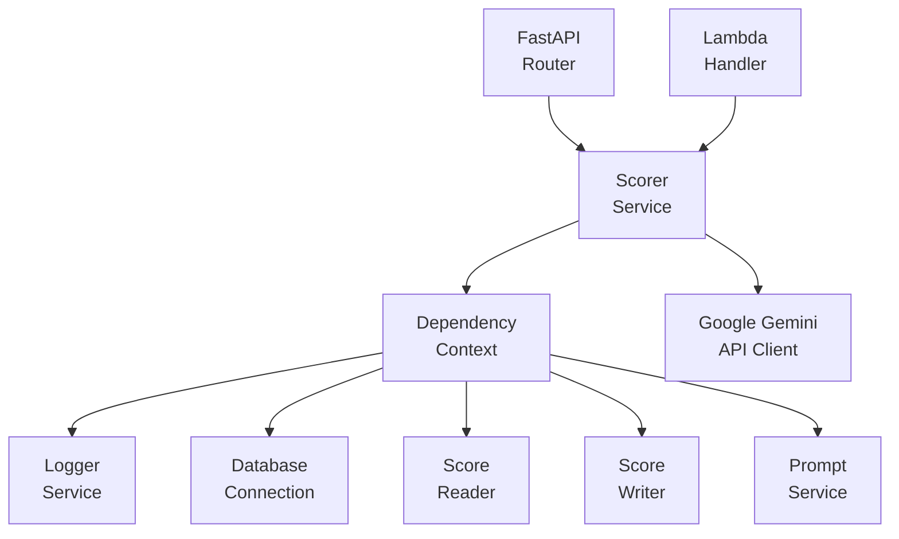
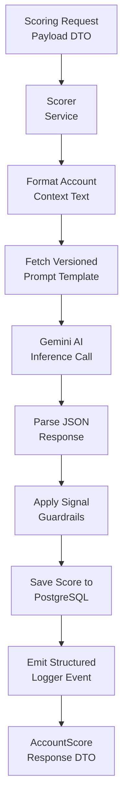
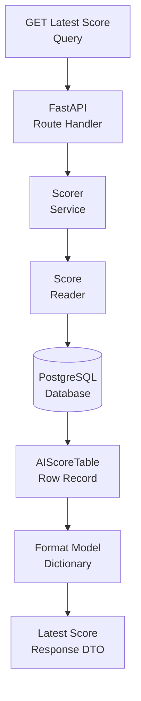
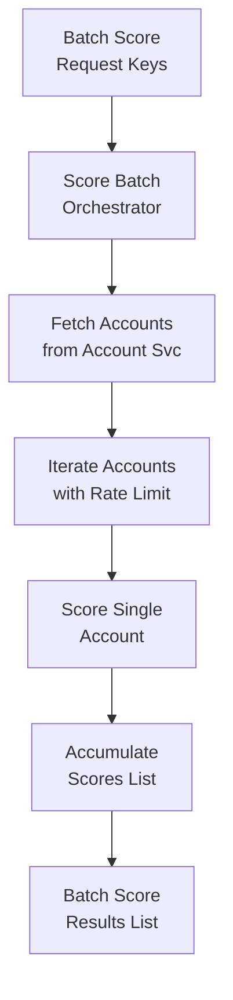

# Scorer Service

The **Scorer Service** is an AI inference and risk qualification microservice in the Sales Intelligence Platform. It formats multi-asset cybersecurity telemetry, interacts with Google Gemini models to compute risk posture scores, applies deterministic safety guardrails against hallucinations, synthesizes executive outreach strategies, and aggregates relational LLM token telemetry.

---

## Architecture & Responsibilities

The service follows clean architecture and domain-driven design principles with strict dependency injection:



### Module Breakdown

```text
scorer/
├── __init__.py
├── api.py                    # FastAPI route handlers & canonical endpoints
├── dependencies.py           # Dependency injection context & lazy proxy
├── Dockerfile                # AWS Lambda container definition
├── lambda_handler.py         # Serverless entry point for standalone execution
├── protocols.py              # Protocol interfaces (IScorerService, IScoreReader, etc.)
├── README.md                 # Service documentation & architecture specs
├── scorer_service.py         # Main AI inference orchestrator & guardrail logic
├── types.py                  # Domain models, scoring DTOs & token stats schemas
├── infra/                    # Declarative Pulumi infrastructure definition
│   └── main.py
├── internals/                # Persistence repositories & internal utilities
│   ├── __init__.py
│   ├── rate_limiter.py       # Thread-safe API rate limiter
│   └── repositories/
│       ├── __init__.py
│       ├── models.py         # Relational SQL table entities (AIScoreTable)
│       ├── reader.py         # ScoreReader database repository
│       └── writer.py         # ScoreWriter database repository
└── tests/                    # Pytest test suite for scorer service
    ├── __init__.py
    └── test_scorer_service.py
```

---

## Domain Logic & Design Conventions

### 1. Pure Dependency Injection
The service accepts a single required context object:
```python
class ScorerService(IScorerService):
    def __init__(self, context: ScorerServiceDependencyContext) -> None:
        self.context: ScorerServiceDependencyContext = context
```
All external dependencies (`logger`, `reader`, `writer`, `db_service`, `accounts_service`, `prompt_service`) are managed and accessed via `self.context`.

### 2. Method Ordering Standard
In every class across the service:
- **Public methods** are declared at the top of the class.
- **Private/internal helper methods** (`_` prefix) are grouped at the bottom under explicit section headers.

### 3. DTO-First Contract
- Every command or query accepts a strictly typed Pydantic DTO (e.g. `ScoreAccountCommand`, `BatchScoreCommand`, `GetPromptQuery`).
- Every service method returns a typed model or response DTO (e.g. `AccountScore`, `LatestScoreResponse`, `ScoreHistoryItem`, `LLMStats`).
- Loose union types like `Union[Account, Dict, Any]` are completely eliminated in favor of strict domain types (`Account`, `SecuritySignal`).

### 4. Deterministic Safety Guardrails & Hallucination Defense
To protect against generative AI hallucinations and ensure trustworthy scoring:
1. **Zero-Critical Ceiling**: If an account has **0 critical signals**, the score is clamped:
   - Max **80** (if $\ge 2$ high-severity signals).
   - Max **70** (if 1 high-severity signal).
   - Max **55** (if medium-severity signals exist).
   - Max **35** (if only low-severity signals exist).
   - Max **20** (if 0 signals exist).
2. **Clean-Perimeter Floor**: If an account has **0 critical, high, and medium signals**, the score cannot exceed **30** (or **18** if 0 total signals).

### 5. Relational Database-Level LLM Analytics (Zero File Tracing)
All LLM execution metadata (prompt tokens, completion tokens, latency, cost USD) is persisted directly into the relational `AIScoreTable` in PostgreSQL. Aggregate metrics (`LLMStats`) are computed via SQL aggregation (`ScoreReader.get_llm_stats`), eliminating disk-bound local trace files.

### 6. Lazy Singleton Proxy (`_LazyScorerServiceProxy`)
The module exposes `default_scorer_service` backed by `_LazyScorerServiceProxy`:
- **Zero Import-Time Side Effects**: Prevents eager database connections or logger initialization during module import.
- **Prevents Circular Imports**: Eliminates import deadlocks when other services cross-reference the scorer.
- **Test Isolation & Ergonomics**: Provides clean syntax for callers while allowing test fixtures to override dependencies before runtime execution.

---

## API Reference

All endpoints are mounted under `/api`:

| Method | Route | Description |
| :--- | :--- | :--- |
| `POST` | `/api/score` | Compute AI risk score, priority tier, and outreach synthesis for an account. |
| `POST` | `/api/score/batch` | Rate-limited batch scoring across multiple account keys. |
| `GET` | `/api/scores/latest/{account_key}` | Retrieve the latest AI score snapshot for an account. |
| `GET` | `/api/scores/history/{account_key}` | Retrieve historical AI score snapshots and version progression. |
| `GET` | `/api/llm-stats` | Aggregate LLM token usage, total calls, average latency, and estimated cost USD. |

---

## Dataflow Diagrams (DFD) & Code Entry Points

### 1. Single Account AI Scoring Flow (`POST /api/score`)



#### 🔍 Code Entry Points & Execution Trace
| Flow Step | Entry Function / Class | Source File | Description |
| :--- | :--- | :--- | :--- |
| **API Route Handler** | `score_account(request)` | [`api.py`](./api.py) | FastAPI endpoint for AI scoring. |
| **Service Scoring Entry** | `ScorerService.score_account(command)` | [`scorer_service.py`](./scorer_service.py) | Main orchestration method for inference and persistence. |
| **Context Formatter** | `ScorerService.format_account_context(account)` | [`scorer_service.py`](./scorer_service.py) | Converts account domains, assets, and signals to prompt text. |
| **Prompt Resolver** | `ScorerService.get_prompt(query)` | [`scorer_service.py`](./scorer_service.py) | Injects formatted context into active prompt template. |
| **Deterministic Guardrails** | `ScorerService._apply_score_guardrails(...)` | [`scorer_service.py`](./scorer_service.py) | Enforces hard ceilings against model hallucination. |
| **Database Writer Repository** | `ScoreWriter.save_score(conn, score)` | [`internals/repositories/writer.py`](./internals/repositories/writer.py) | Saves score snapshot and updates latest version flag. |

---

### 2. Score History & Snapshot Retrieval (`GET /api/scores/latest/{account_key}`)



#### 🔍 Code Entry Points & Execution Trace
| Flow Step | Entry Function / Class | Source File | Description |
| :--- | :--- | :--- | :--- |
| **API Latest Route** | `get_scorer_latest_endpoint(account_key)` | [`api.py`](./api.py) | Retrieves the most recent AI score for an account. |
| **API History Route** | `get_scorer_history_endpoint(account_key)` | [`api.py`](./api.py) | Returns all historical AI score runs across versions. |
| **Service Latest Fetch** | `ScorerService.get_latest_score(account_key)` | [`scorer_service.py`](./scorer_service.py) | Resolves latest score snapshot with fallback logic. |
| **Database Reader Repository** | `ScoreReader.get_latest_score(conn, key)` | [`internals/repositories/reader.py`](./internals/repositories/reader.py) | Queries SQL indexed tables with version fallback. |

---

### 3. Batch Scoring Pipeline Flow (`POST /api/score/batch`)



#### 🔍 Code Entry Points & Execution Trace
| Flow Step | Entry Function / Class | Source File | Description |
| :--- | :--- | :--- | :--- |
| **API Batch Route** | `score_batch(account_keys, limit)` | [`api.py`](./api.py) | FastAPI endpoint for batch scoring. |
| **Batch Orchestrator** | `ScorerService.score_batch(command)` | [`scorer_service.py`](./scorer_service.py) | Fetches accounts and orchestrates rate-limited scoring passes. |
| **Rate Limiter** | `GlobalRateLimiter.acquire()` | [`internals/rate_limiter.py`](./internals/rate_limiter.py) | Thread-safe pacing to prevent Google API quota exhaustion. |

---

## Testing & Quality Assurance

### 1. Run Unit & Integration Tests
```powershell
pytest src/services/scorer/tests -v
```

### 2. Code Coverage Report
Measure branch and line coverage across the scorer service domain:
```powershell
pytest src/services/scorer/tests -v --cov=src.services.scorer --cov-report=term-missing --cov-report=html
```

### 3. Static Type Checking (Pyright)
Ensure 100% strict type safety across protocol interfaces, models, and service classes:
```powershell
npx pyright src/services/scorer
```

### 4. Code Formatting & Linting (Ruff - PEP 8)
Check and enforce PEP 8 style guidelines with a max line length of 88 characters:

```powershell
# Check for lint issues and import sorting
ruff check src/services/scorer --line-length=88

# Check formatting without modifying files
ruff format src/services/scorer --line-length=88 --check

# Format all code to PEP 8 standard
ruff format src/services/scorer --line-length=88
```

---

## Local Development & Microservice Execution

### Run as Standalone Microservice
You can run the scorer service independently using Uvicorn and its dedicated `lambda_handler.py`:

```powershell
uvicorn src.services.scorer.lambda_handler:app --reload --port 8002
```

### Health Check
```powershell
curl http://localhost:8002/health
```

---

## Containerization & Deployment

### 1. Build & Run with Docker
The scorer service includes a standalone AWS Lambda-compatible container definition (`Dockerfile`):

```powershell
# Build container image
docker build -f src/services/scorer/Dockerfile -t scorer-microservice:latest .

# Run container locally with RIE (Runtime Interface Emulator)
docker run -p 9000:8080 --env-file backend/.env scorer-microservice:latest
```

### 2. Infrastructure as Code & Service Deployment

#### Deploy ONLY the Scorer Microservice
To build, push to ECR, and deploy only the Scorer Lambda function without touching other services:

```powershell
# Windows PowerShell
.\src\services\infra\deploy.ps1 -Service scorer -Stack dev

# macOS / Linux
./src/services/infra/deploy.sh -s scorer --stack dev
```

#### Deploy Entire Stack (All Services + Database + Frontend)
To provision or update the complete infrastructure across all microservices:

```powershell
cd src/services/infra
pulumi up --stack dev
```
