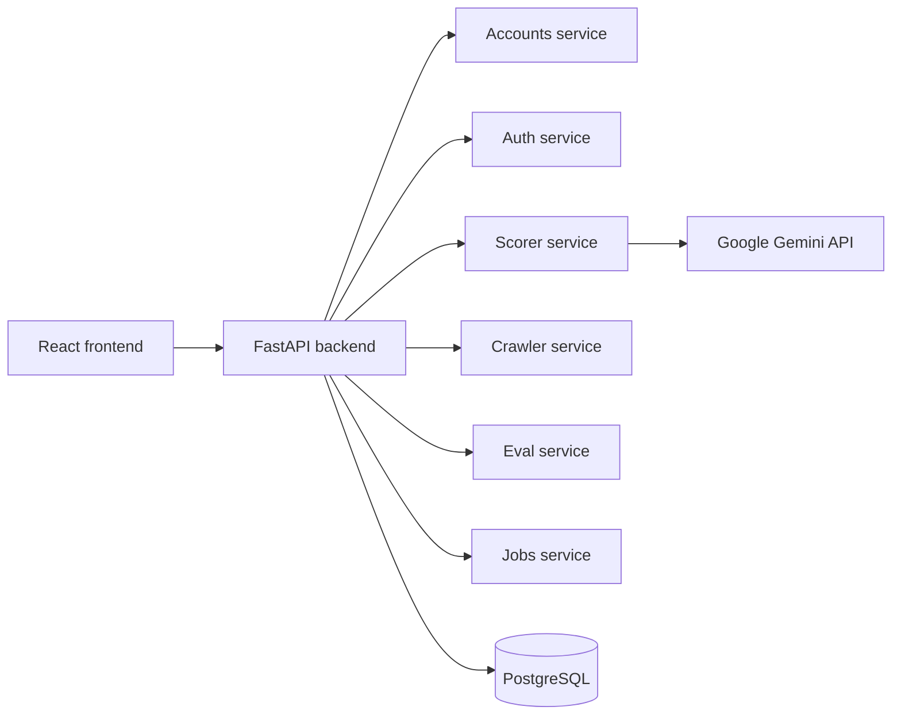

# System Architecture

## Overview

This repository is a local web application for sales intelligence and cybersecurity account review. It uses a FastAPI backend, a Vite + React frontend, and a PostgreSQL database as the primary persistence layer.

## Domain structure

The backend is intentionally organized by feature area:

- core/ shared config, dependencies, logging, exceptions, and formatting
- services/accounts/ account query, listing, and detail APIs
- services/auth/ JWT auth and API key handling
- services/scorer/ Gemini-based scoring and score history
- services/crawler/ scan jobs and crawler API
- services/eval/ benchmark and comparison tooling
- services/prompts/ prompt version management
- services/jobs/ background job lifecycle processing
- services/database/ database init and health endpoints

## Persistence model

The code path is PostgreSQL-first:

- DATABASE_URL is the main runtime configuration value
- DatabaseService prefers a real PostgreSQL engine
- SQLite is only used for isolated test DBs
- runtime logic expects a persistent relational database and a configured environment

## API routing

The main app mounts its routers in ackend/src/main.py:

- /api/auth
- /api/accounts
- /api/score
- /api/crawler
- /api/eval
- /api/prompts
- /api/jobs
- /api/database

The frontend interacts with these routes through the xios client configured in rontend/src/api.ts.

## Operational notes

- environment variables are read in ackend/src/core/config.py
- GEMINI_API_KEY is used for live scoring and eval runs
- JWT_SECRET is required for user authentication in local and deployed environments
- the app exposes a Swagger UI at /docs when the backend is running

## Architecture summary

The current system is best described as a modular local web architecture. It is straightforward to run, test, and extend in a normal development environment while supporting production-ready PostgreSQL-backed behavior.
