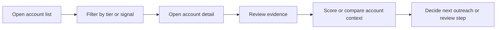

# Strategic Planning and ICP

## Why the product matters

This platform helps sales and security teams focus on the accounts that are most likely to have immediate exposure or urgency. It combines account data, signal summaries, and AI-assisted scoring into a single workflow.

## Core user segments

- account executives and SDRs
- security analysts and operational teams
- platform owners running evaluation workflows

## Priority tiers

The app deals in account tiers that reflect urgency and risk:

- 	ier_1_critical
- 	ier_2_high
- 	ier_3_medium
- 	ier_4_low

These tiers drive what the UI displays and how the user prioritizes outreach or review.

## Decision framework

Good account triage blends three inputs:

1. account context and public-facing footprint
2. signal severity and evidence quality
3. model-assisted prioritization and human judgement

This makes the score and tier output more useful than a raw ranking alone.

## Example journey

## Guidance for use

The best workflow is evidence-guided. The scoring layer helps prioritize accounts, but the user should still verify the underlying account context before acting on it.
