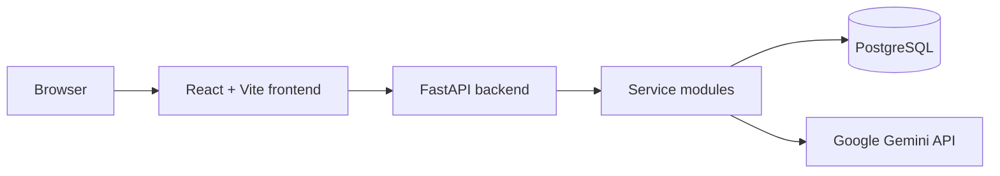
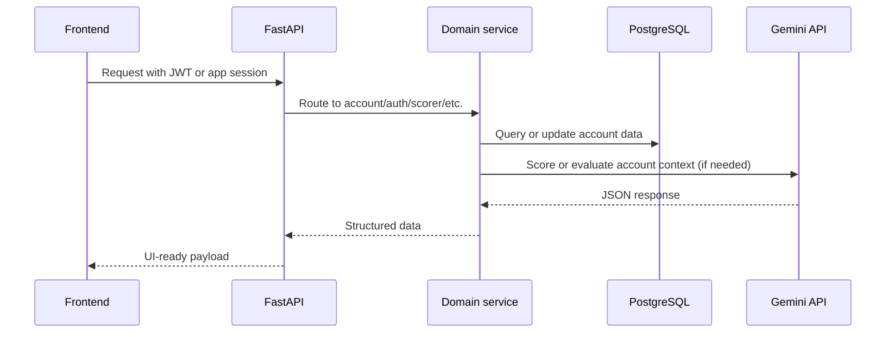

# Architecture Overview

## High-level architecture

The repository is organized as a local monorepo with one backend and one frontend.

## Backend structure

The backend lives under `backend/src` and is organized by domain:

- core/ — shared configuration, dependencies, exceptions, logging, and formatters
- main.py — app bootstrap and router registration
- services/accounts/ — account catalog, search, stats, and account detail flows
- services/auth/ — signup, signin, JWT generation, API key management
- services/scorer/ — LLM scoring, score persistence, and score-history APIs
- services/crawler/ — crawler jobs and scan endpoints
- services/eval/ — eval harness and prompt comparison workflows
- services/prompts/ — prompt version registry
- services/jobs/ — async job lifecycle management
- services/database/ — database bootstrap, health, and query support

## Runtime responsibilities

| Layer | Responsibility |
| :--- | :--- |
| Frontend | Vite React application, auth, dashboard, account views, developer tools |
| Backend API | FastAPI entry point and router composition |
| Domain services | Business logic for auth, scoring, accounts, crawlers, prompts, and jobs |
| Database layer | PostgreSQL-backed persistence with SQLModel and system-level health checks |
| External API | Gemini model calls used by the scorer and eval services |

## Database and persistence model

The app is intentionally PostgreSQL-first:

- DatabaseService defaults to DATABASE_URL
- production code assumes PostgreSQL availability
- SQLite is used only when tests pass a temporary DB path
- the service layer loads and persists relational models through SQLModel objects

This means the repository is best understood as a normal local web application with a real database.

## Request flow

## Operational assumptions

- `.env` config values are loaded by `backend/src/core/config.py`
- GEMINI_API_KEY is required for scoring and evals unless the user stores one in their profile
- JWT_SECRET and DATABASE_URL should be configured explicitly in local or deployed environments
- the app exposes interactive API docs via FastAPI Swagger at /docs

## What is deliberately not part of the current codebase

This repository is centered on a standard API + database application. The current code and runtime configuration are structured around a conventional local web stack rather than legacy cloud-specific architecture assumptions.
