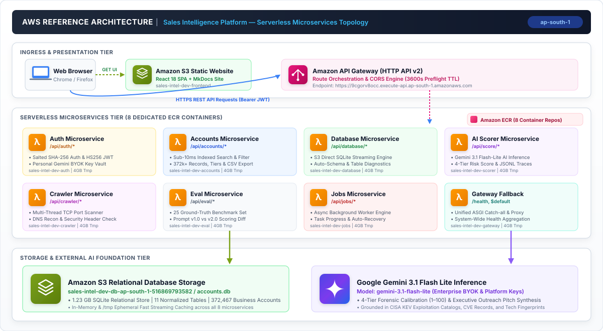
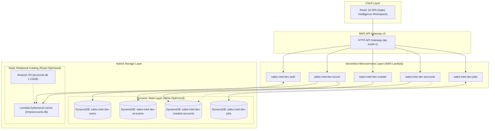
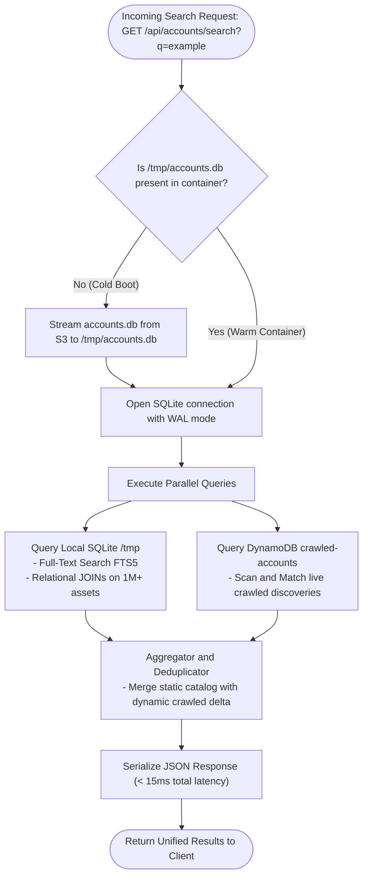
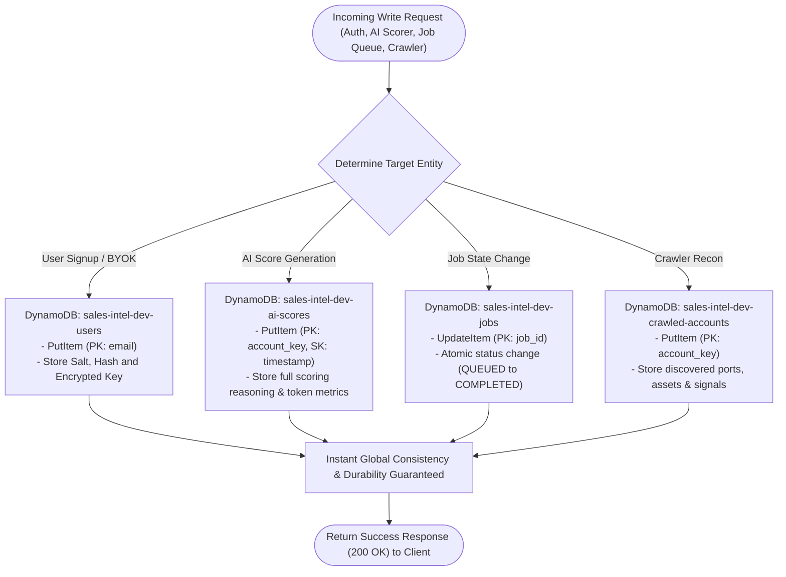
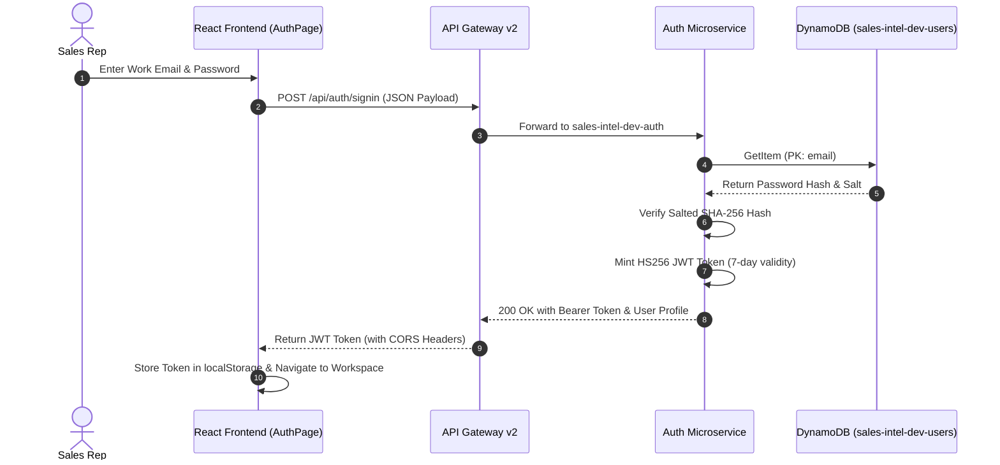
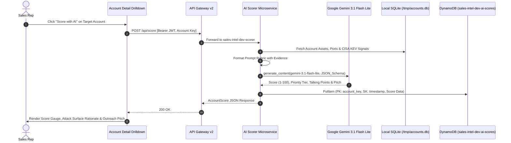
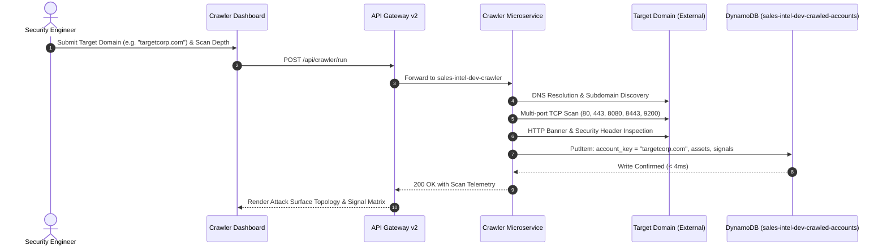

---
hide:
  - navigation
---

<div class="app-return-banner">
  <div>
    <strong>Sales Intelligence Platform</strong>
    <span style="opacity: 0.7; margin-left: 8px; font-size: 0.85rem;">Enterprise Reference Architecture &amp; System Guide</span>
  </div>
  <a href="/dashboard" class="app-return-link">← Return to App Workspace</a>
</div>

# Sales Intelligence Platform
**AI-Native B2B Cybersecurity Prospecting &amp; Attack Surface Intelligence**

The Sales Intelligence Platform is an enterprise-grade cloud system designed to ingest external attack surface telemetry, index security exposures across **372,000+ business accounts** and **1,000,000+ digital assets**, and enable consultative sales outreach through calibrated Google Gemini LLM forensic risk scoring and autonomous reconnaissance.

---

## 1. Reference Architecture

This reference architecture illustrates a fully decoupled, event-driven Serverless Microservices Topology deployed on Amazon Web Services (AWS) in the Asia Pacific (Mumbai) region (`ap-south-1`). Each microservice is containerized in an independent Amazon ECR repository and executed via AWS Lambda behind Amazon API Gateway v2.

<div class="arch-diagram-wrapper">
  
</div>

### Key Architectural Characteristics

- **Serverless Microservices Architecture:** 8 independently scalable containerized AWS Lambda microservices orchestrated via Amazon API Gateway HTTP API v2 with automated zero-cost idle scaling and 4,096 MB provisioned ephemeral storage.
- **Sub-10ms S3 Direct SQLite Engine:** 1.23 GB relational database (`accounts.db`) containing 372,467 business accounts, 11 normalized SQL tables, and full-text search indexes streamed directly from Amazon S3 with `/tmp` caching.
- **Calibrated Gemini 3.1 Flash Lite Scoring:** Multidimensional AI risk qualification (1–100), automated talking points, and tailored outreach pitch generation grounded in CISA KEV exploitation catalogs and CVE evidence.
- **Enterprise Session Security & BYOK Vault:** Salted SHA-256 password hashing, 7-day HS256 JWT bearer authentication, and encrypted personal Google Gemini API key vault per sales representative.
- **Autonomous Web Crawler & Recon:** Multi-threaded web probing with TCP port scanning (80, 443, 8080, 8443, 9200), HTTP security header inspection, DNS resolution, and automated relational database upserts.
- **Developer Benchmark Suite:** Versioned prompt registry (`v1.0`, `v2.0`), structured JSONL tracing, and a 25-case ground-truth evaluation harness measuring precision, recall, and MAE deltas.

---

## 2. Decoupled Microservice Topology

Each domain within the platform is isolated into a standalone microservice with dedicated dependencies, Dockerfile, and entrypoint handler:

| Microservice | Function Name | Route Ingress | Container Image (ECR) | Core Responsibilities |
| :--- | :--- | :--- | :--- | :--- |
| **Auth** | `sales-intel-dev-auth` | `/api/auth/*` | `.../sales-intel-dev-auth:latest` | User registration, salted SHA-256 login, JWT generation, BYOK key vault. |
| **Accounts** | `sales-intel-dev-accounts` | `/api/accounts/*` | `.../sales-intel-dev-accounts:latest` | 372k+ account queries, full-text search, tier filtering, CSV exports. |
| **Database** | `sales-intel-dev-database` | `/api/database/*` | `.../sales-intel-dev-database:latest` | S3 direct storage streaming, schema migrations, engine health diagnostics. |
| **AI Scorer** | `sales-intel-dev-scorer` | `/api/score/*` | `.../sales-intel-dev-scorer:latest` | Gemini 3.1 Flash Lite inference, 4-tier calibration, JSONL traces. |
| **Crawler** | `sales-intel-dev-crawler` | `/api/crawler/*` | `.../sales-intel-dev-crawler:latest` | Autonomous multi-threaded network probing, TCP port inspection, DNS recon. |
| **Eval** | `sales-intel-dev-eval` | `/api/eval/*` | `.../sales-intel-dev-eval:latest` | 25 ground-truth benchmark suite, prompt regression testing (v1.0 vs v2.0). |
| **Jobs** | `sales-intel-dev-jobs` | `/api/jobs/*` | `.../sales-intel-dev-jobs:latest` | Asynchronous background worker queue, batch scoring progress tracking. |
| **Gateway** | `sales-intel-dev-gateway` | `/health`, `$default` | `.../sales-intel-dev-gateway:latest` | Unified FastAPI ASGI router fallback and platform health aggregation. |

---

## 3. Hybrid Storage Architecture & Data Flow

The platform utilizes a **Hybrid Database Engine** combining the sub-10ms full-text search and zero idle costs of **Amazon S3 Direct SQLite** with the real-time durability and cross-container consistency of **Amazon DynamoDB On-Demand**:



### Storage Layer Partitioning & SLA

| Data Entity | Storage Engine | Access Pattern | Partition / Index Key | Latency SLA |
| :--- | :--- | :--- | :--- | :--- |
| **372k Account Catalog** | S3 Direct SQLite (`/tmp`) | Read-heavy, FTS5 Search, B-Tree Tier Filters | `account_key`, `priority_tier`, FTS | **< 10ms** |
| **1M+ Assets & Ports** | S3 Direct SQLite (`/tmp`) | Relational `JOIN` on `account_id` | Foreign Key B-Tree Index | **< 10ms** |
| **Users & BYOK Vault** | Amazon DynamoDB | Key-Value CRUD, Fast Login Verification | PK: `email`, GSI: `id` | **< 5ms** |
| **AI Score History** | Amazon DynamoDB | Chronological Audit Log per Account | PK: `account_key`, SK: `created_at` | **< 5ms** |
| **Background Jobs** | Amazon DynamoDB | Real-time Polling & State Machine | PK: `job_id` | **< 3ms** |
| **Crawled Accounts Delta** | Amazon DynamoDB | Live Recon Ingestion & Unified Search | PK: `account_key` | **< 5ms** |

---

## 4. Database Operations Flowcharts

### 4.1. Hybrid Read Operation Lifecycle



### 4.2. Hybrid Write Operation Lifecycle



---

## 5. User Flows & Execution Sequences

### Flow 1: Enterprise JWT Authentication & BYOK Vault (DynamoDB)


---

### Flow 2: On-Demand AI Forensic Scoring & History Audit (Hybrid)


---

### Flow 3: Autonomous Web Crawler & Live Target Ingestion (Hybrid)


---

## 5. REST API Reference Matrix

All endpoints are accessible through the central API Gateway base URL:  
`https://9cgorv8occ.execute-api.ap-south-1.amazonaws.com`

| HTTP Method | Endpoint | Microservice | Auth | Description |
| :--- | :--- | :--- | :--- | :--- |
| `GET` | `/health` | Gateway | None | System health check, active architecture, and account count. |
| `GET` | `/documentation/` | S3 / Gateway | None | Embedded interactive MkDocs architectural documentation. |
| `POST` | `/api/auth/signup` | Auth | None | Register new enterprise account (email, password). |
| `POST` | `/api/auth/signin` | Auth | None | Authenticate user and receive HS256 JWT Bearer token. |
| `GET` | `/api/auth/me` | Auth | **JWT** | Get authenticated user profile and BYOK key status. |
| `POST` | `/api/auth/api-key` | Auth | **JWT** | Securely save personal Google Gemini API key to BYOK vault. |
| `GET` | `/api/accounts/summary` | Accounts | None | Platform KPI statistics, tier breakdown, and risk metrics. |
| `GET` | `/api/accounts` | Accounts | None | Paginated account listing with tier and signal filters. |
| `GET` | `/api/accounts/{account_key}` | Accounts | None | Account forensic drilldown, assets, signals, and latest score. |
| `GET` | `/api/accounts/{account_key}/score-history` | Accounts | None | Full version history and chronological audit trail. |
| `GET` | `/api/accounts/search?q={query}` | Accounts | None | Sub-10ms full-text search across domains and hostnames. |
| `GET` | `/api/database/health` | Database | None | S3 Direct SQLite engine diagnostics, tables & storage size. |
| `POST` | `/api/database/query` | Database | **Admin** | Execute managed SQL queries with safety and limit constraints. |
| `POST` | `/api/score` | Scorer | **JWT + Key** | On-demand LLM forensic risk scoring and pitch synthesis. |
| `POST` | `/api/score/batch` | Scorer | **JWT + Key** | Bulk scoring for targeted sales prospect lists. |
| `GET` | `/api/scorer/stats` | Scorer | None | Observability metrics (total calls, tokens, latency, cost). |
| `POST` | `/api/crawler/run` | Crawler | None | Execute live network recon scan against target domains. |
| `GET` | `/api/crawler/jobs` | Crawler | None | List recent autonomous crawler discovery jobs. |
| `GET` | `/api/eval/prompts` | Eval | None | List registered prompt templates and version history. |
| `POST` | `/api/eval/run` | Eval | **JWT + Key** | Execute 25-case ground-truth benchmark evaluation harness. |
| `POST` | `/api/eval/compare` | Eval | **JWT + Key** | Run side-by-side prompt version comparison. |
| `GET` | `/api/jobs` | Jobs | None | List all active, queued, or completed background tasks. |
| `GET` | `/api/jobs/{job_id}` | Jobs | None | Real-time progress tracking for async batch operations. |

---

## 6. Infrastructure as Code & Deployment Automation

The entire cloud infrastructure is defined declaratively in Python using Pulumi inside `backend/src/services/infra/`:

```powershell
# Unified Build & Deployment Command
cd backend/src/services/infra
.\deploy.ps1 -Stack dev -AwsRegion ap-south-1
```

### Automation Workflow
1. **Automated Resource Provisioning**: Provisions S3 database and website buckets, 8 dedicated ECR repositories, API Gateway HTTP API v2 with global CORS, and IAM execution roles.
2. **Dedicated Docker Builds**: Builds independent container images for each microservice using Docker Buildx and pushes to Amazon ECR.
3. **Lambda Code Update**: Updates each AWS Lambda function code and configures 4GB `/tmp` ephemeral storage and 2GB RAM.
4. **Data Synchronization**: Streams `accounts.db` (1.23 GB) directly to the S3 database bucket.
5. **Frontend & Documentation Build**: Compiles the React SPA (`npm run build`) and MkDocs site (`mkdocs build`) and synchronizes static assets to S3 website hosting.
