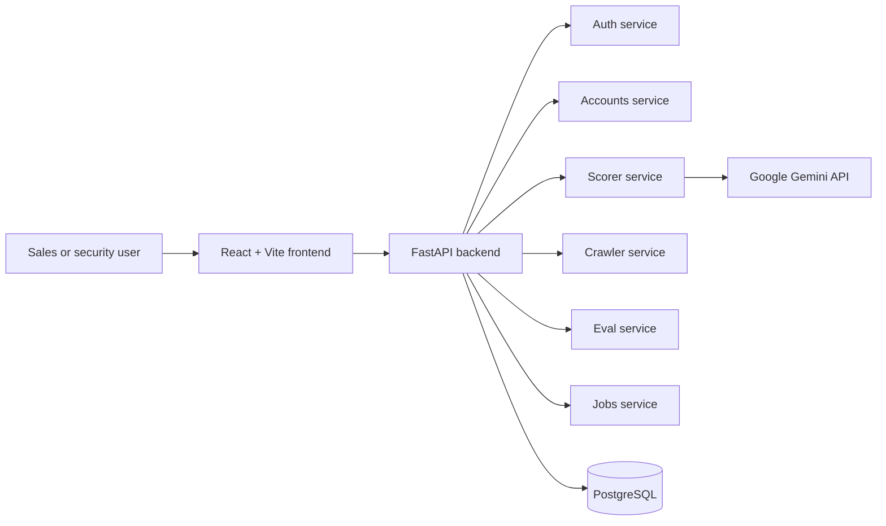

# Sales Intelligence Platform

This project is a local-first sales intelligence workspace for cybersecurity prospecting. It combines a FastAPI backend, a Vite + React frontend, and PostgreSQL-backed data services to search accounts, review signals, and score account risk with Gemini.

## System overview



## What the platform includes

- account listing, filtering, and detailed account views
- JWT-based authentication with user-managed Gemini API keys
- risk scoring with LLM-generated summaries and score history
- prompt registry and eval comparison workflows
- background job orchestration and dashboard health checks
- modular service packages for clear domain boundaries

## Current architecture

The app is a normal Python service stack with a React frontend and a PostgreSQL-backed backend:

- `backend/src/main.py` mounts the public API routers
- `backend/src/services/*` groups domain logic by feature area
- `DatabaseService` prefers `DATABASE_URL` and PostgreSQL
- SQLite is only used for isolated test fixtures and local debugging
- the frontend calls the backend via http://localhost:8000/api

## Local developer workflow

```bash
cd backend
python -m venv .venv
.\.venv\Scripts\Activate.ps1
pip install -r requirements.txt
copy .env.example .env
python src/main.py
```

Then in another terminal:

```bash
cd frontend
npm install
npm run dev
```

The UI is available at http://localhost:5173 and the API at http://localhost:8000/docs.

## Key backend routes

- /api/auth — signup, signin, profile, API key management
- /api/accounts — search, list, detail, summary, signal filtering
- /api/score — scorer execution and history retrieval
- /api/crawler — crawler jobs and scan endpoints
- /api/eval — prompt eval runs and comparisons
- /api/prompts — prompt template registry
- /api/jobs — async job lifecycle operations
- /api/database — DB health and raw query helpers

## Storage and data model

The app uses a relational PostgreSQL database as the system of record. The service layer is written with SQLModel and the database utilities detect whether the connection is PostgreSQL or a temporary SQLite test connection.

This keeps the local developer experience simple while still supporting a real production database path.

## Operational guidance

- put your runtime database connection in `backend/.env`
- store the Gemini API key in the environment or in a user profile
- run the backend and frontend together during development
- prefer tests in the service directories for validation before changing behavior
