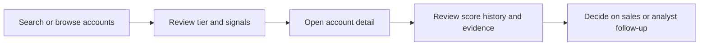

# Strategic Planning and ICP

## Why this product exists

The core product problem is simple: there are many companies with public-facing infrastructure, but not all of them are equally likely to need a cybersecurity solution right now. The platform helps teams focus on the accounts with the strongest signal of active exposure, operational weakness, or reputational risk.

The product is designed for sales and security teams that want to answer three questions quickly:

1. Which accounts deserve attention?
2. Why do they matter?
3. What is the most credible outreach strategy?

## Target user

The app is aimed at:

- account executives and sales development reps
- security or advisory teams evaluating external exposure
- product teams running model-based evaluations and prompt tuning

## Priority tiers

The system uses `priority_tier` values to group accounts into operational buckets:

- `tier_1_critical`
- `tier_2_high`
- `tier_3_medium`
- `tier_4_low`

This classification is used by the UI and API so sales teams can filter work by urgency and then open a detailed account page for evidence-backed review.

## Example scoring logic

The platform blends account data, signals, and AI model analysis. In practice, signals such as critical findings, public exposures, and product or protocol mismatches help the model reason about likely urgency. The score is not a substitute for human judgment, but it provides a consistent starting point for triage.

## Buying-signal model

Strong signals in the app tend to cluster around items like:

- externally visible risk or misconfiguration
- critical severity findings on the account perimeter
- open or notable ports and technology exposures
- high-risk product stacks or outdated technologies
- account-level patterns that suggest immediate security concern

This is especially relevant for sales teams selling security products where urgency and exposure are stronger buying signals than abstract firmographic data alone.

## Recommended workflow

## Good operating principle

The best use of the system is not raw score obsession but evidence-guided triage. A high score is most useful when it is paired with account context, clear signal explanations, and a human understanding of the account’s risk posture.

That is why the product includes account detail pages, signal summaries, score history, and prompt evaluation workflows rather than only an opaque model output.
