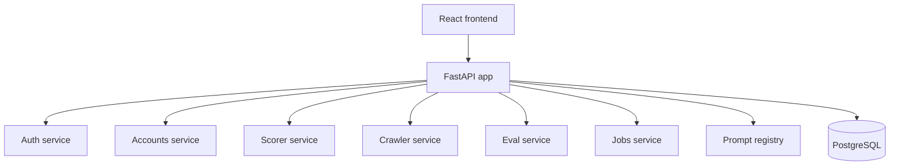

# Technical Design Document

## 1. Summary

This project uses a modular, service-oriented backend with a PostgreSQL system of record and a React frontend. The design stays intentionally simple: each domain has its own backend package, and the API is exposed through one FastAPI app.

## 2. Domain layout

## 3. Service responsibilities

### Auth

- signup, sign-in, and JWT handling
- user profile retrieval
- local user-level Gemini API key storage

### Accounts

- list and filter accounts
- retrieve account details and score history
- compute summary stats and tier summaries
- support domain and signal-based queries

### Scorer

- build account context
- call Gemini with account evidence
- normalize score, tier, and response payloads
- persist a score audit trail in the database

### Crawler and jobs

- trigger scan and processing jobs
- track job lifecycle state
- expose scan and background-task endpoints to the UI

### Eval and prompts

- run benchmark-style prompt comparisons
- expose prompt registry APIs
- manage template versions and eval results

## 4. Important implementation assumptions

- PostgreSQL is the production path and is configured with DATABASE_URL
- SQLite is used only for tests and isolated DB fixtures
- the frontend authenticates with bearer tokens generated by the backend
- Gemini access is provided either from the environment or from a user profile entry

## 5. API entry points

The app is assembled in ackend/src/main.py and includes the following router groups:

- /api/auth
- /api/accounts
- /api/score
- /api/crawler
- /api/eval
- /api/prompts
- /api/jobs
- /api/database

## 6. Data model approach

The project relies on SQLModel and relational tables for persistent state. The storage layer is designed to support real account data, users, jobs, prompts, and scoring results in a single coherent schema.

## 7. Design rationale

This architecture is intentionally practical. It keeps the app easy to run locally, easy to debug, and easy to test while still giving the platform enough modularity to grow as features expand.
